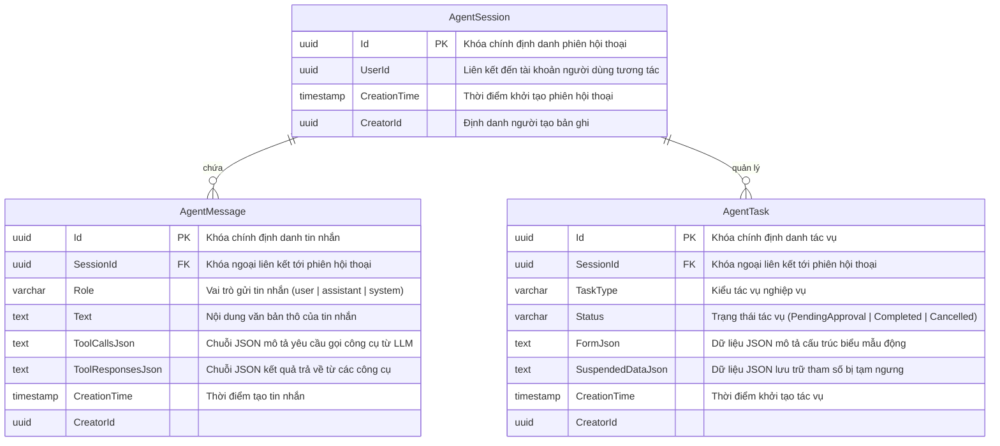
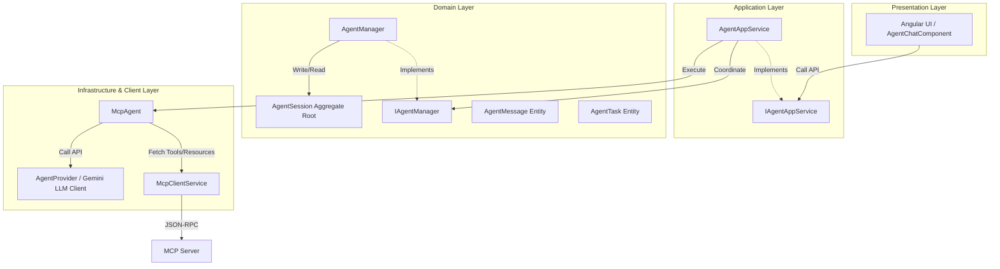
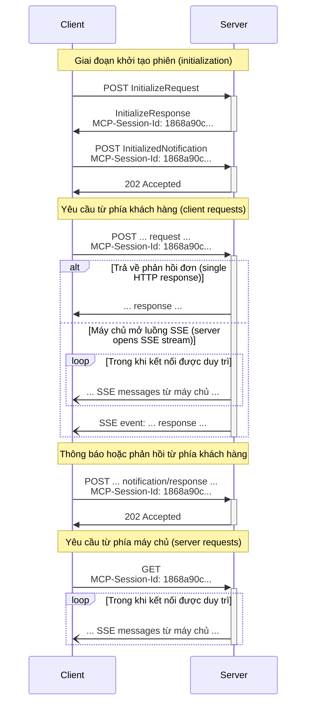
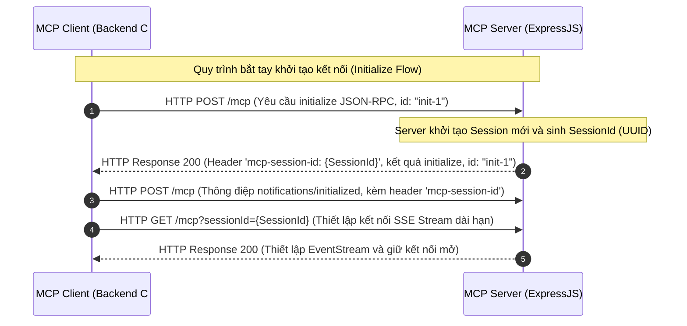
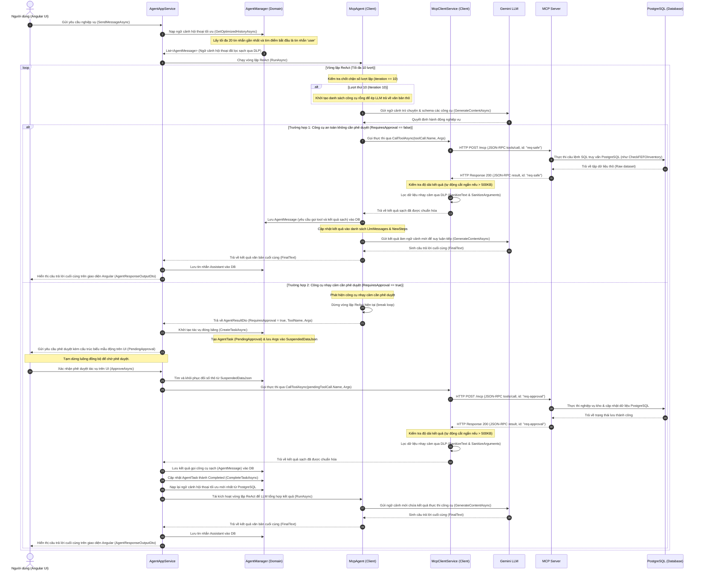
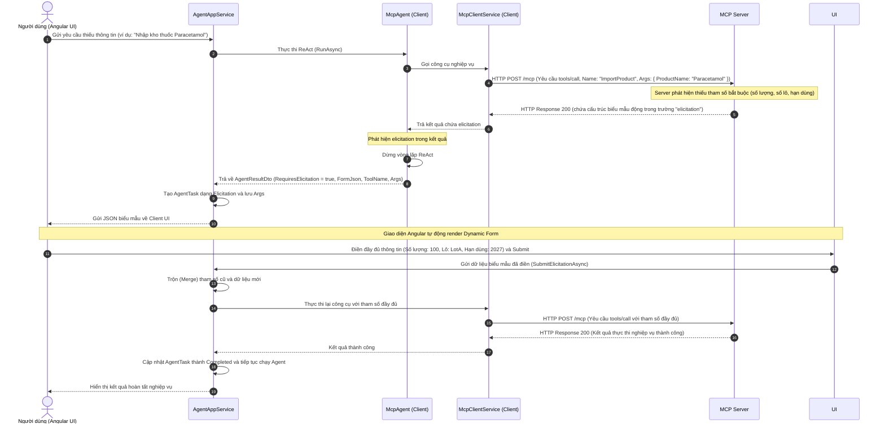
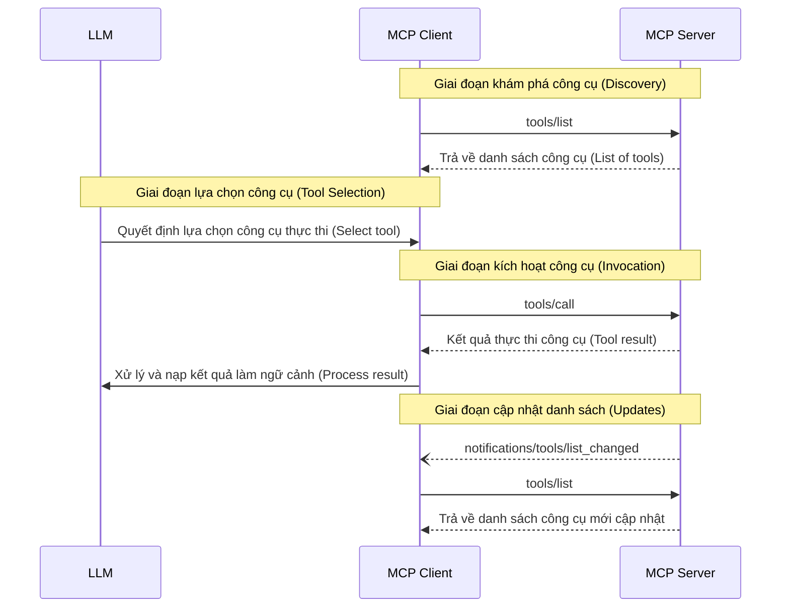
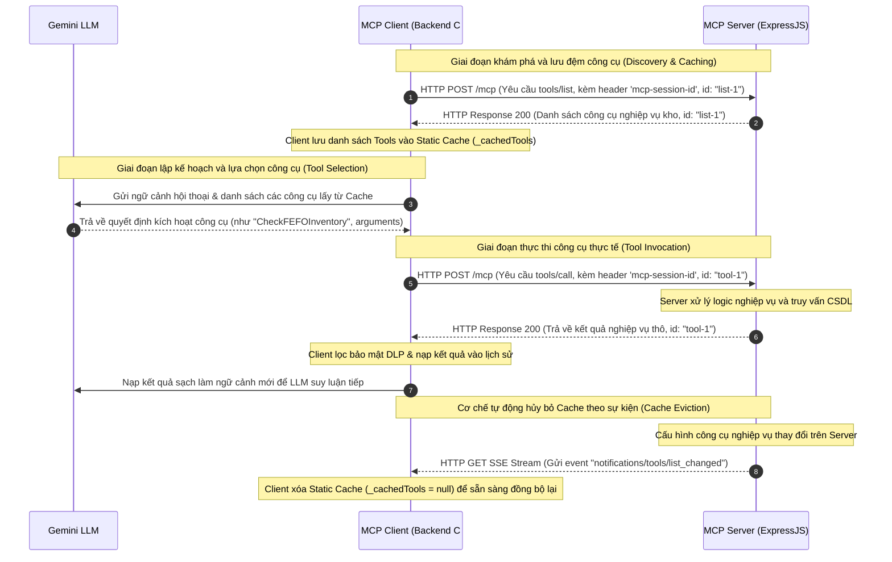

# PHÂN HỆ TRỢ LÝ ẢO THÔNG MINH (AI AGENT) VÀ GIAO THỨC PHẢN ÁNH NGỮ CẢNH MÔ HÌNH (MODEL CONTEXT PROTOCOL - MCP)

---

## CHƯƠNG 2: CƠ SỞ LÝ THUYẾT

### 2.7. Lý thuyết về Tác tử Trí tuệ Nhân tạo (AI Agent) và Giao thức Model Context Protocol (MCP)

#### 2.7.1. Hệ thống Tác tử Trí tuệ Nhân tạo (AI Agent) và Kiến trúc Suy luận ReAct
Tác tử Trí tuệ Nhân tạo (AI Agent) là một thực thể phần mềm tự trị, tích hợp các mô hình ngôn ngữ lớn (LLM) làm bộ não suy luận trung tâm, sở hữu khả năng nhận thức môi trường xung quanh, đưa ra các quyết định hành động tối ưu dựa trên mục tiêu định trước, và tương tác trực tiếp với thế giới bên ngoài thông qua việc kích hoạt các công cụ phần mềm. Sự khác biệt cơ bản giữa một AI Agent và một mô hình ngôn ngữ lớn (LLM) thông thường nằm ở tính tự trị (autonomy) và khả năng thực thi hành động vòng lặp (action loop). Trong khi LLM thông thường chỉ phản hồi tĩnh dưới dạng văn bản dựa trên dữ liệu ngữ cảnh cố định, AI Agent có khả năng chủ động lập kế hoạch, tự chia nhỏ mục tiêu phức tạp thành các nhiệm vụ con, và liên tục điều chỉnh kế hoạch hành động dựa trên phản hồi động từ môi trường.

Để thực thi quá trình suy luận và hành động một cách có hệ thống, các hệ thống tác tử hiện đại thường áp dụng kiến trúc **ReAct (Reasoning and Acting)**. Phương pháp luận ReAct đề xuất sự kết hợp đồng bộ giữa khả năng suy luận logic từng bước (Thought) và các hành động tương tác thực tế (Action). Quá trình vận hành tuân theo vòng lặp kín bao gồm bốn giai đoạn liên tiếp:
1.  **Thought (Suy luận):** Tác tử phân tích trạng thái hiện tại, mục tiêu của người dùng và lập kế hoạch cho bước đi tiếp theo.
2.  **Action (Hành động):** Tác tử lựa chọn một công cụ cụ thể từ danh sách các API có sẵn và xác định các đối số truyền vào cần thiết.
3.  **Observation (Quan sát/Phản hồi):** Hệ thống thực thi công cụ và trả kết quả về cho tác tử.
4.  **Re-evaluation (Tái đánh giá):** Tác tử tiếp nhận kết quả phản hồi để làm ngữ cảnh mới, đánh giá xem mục tiêu đã đạt được chưa và tiếp tục suy luận cho lượt tiếp theo.

Kiến trúc ReAct khắc phục được hai điểm hạn chế cốt lõi của các phương pháp tiếp cận cũ: hiện tượng ảo tưởng thông tin (hallucination) của phương pháp chỉ suy luận (Chain of Thought) và tính thiếu linh hoạt, dễ gãy luồng xử lý của phương pháp chỉ hành động (Action-only).

#### 2.7.2. Giao thức Model Context Protocol (MCP) và Giao thức JSON-RPC 2.0
Model Context Protocol (MCP) là một tiêu chuẩn kiến trúc truyền thông mở được thiết kế nhằm chuẩn hóa việc trao đổi dữ liệu và ngữ cảnh giữa các ứng dụng trí tuệ nhân tạo (MCP Client) với các nguồn dữ liệu, dịch vụ API nghiệp vụ doanh nghiệp (MCP Server). MCP thiết lập một ranh giới bảo mật rõ ràng: mô hình trí tuệ nhân tạo không trực tiếp truy cập vào cơ sở dữ liệu hay mã nguồn nghiệp vụ nội bộ, mà tất cả các tương tác đều được kiểm soát và chuẩn hóa thông qua giao diện truyền thông của giao thức.

Giao thức truyền tin nền tảng của MCP là **JSON-RPC 2.0**. Đây là một giao thức gọi hàm từ xa (Remote Procedure Call - RPC) không trạng thái (stateless) và có cấu trúc dữ liệu gọn nhẹ dựa trên định dạng JSON. Giao thức này cho phép trao đổi dữ liệu hai chiều bất đồng bộ giữa MCP Client và MCP Server.

Các cấu trúc thông điệp cơ bản trong JSON-RPC 2.0 bao gồm:
*   **Request Object (Thông điệp yêu cầu):** Yêu cầu thực thi một phương thức cụ thể trên máy chủ. Gói tin bắt buộc phải chứa trường `id` để ánh xạ kết quả phản hồi.
    ```json
    {
      "jsonrpc": "2.0",
      "method": "tools/call",
      "params": {
        "name": "CheckFEFOInventory",
        "arguments": { "productId": "d5b12852-c07a-4c28-98e3-82b542475471" }
      },
      "id": "req-101"
    }
    ```
*   **Response Object (Thông điệp phản hồi):** Kết quả trả về sau khi thực thi yêu cầu. Nếu thành công, gói tin chứa trường `result`. Nếu thất bại, gói tin trả về trường `error` chứa mã lỗi tiêu chuẩn (Error Code) và thông điệp mô tả lỗi. Trường `id` phải trùng khớp với gói tin yêu cầu tương ứng.
    ```json
    {
      "jsonrpc": "2.0",
      "result": {
        "content": [{ "type": "text", "text": "Stock available: 150 units" }]
      },
      "id": "req-101"
    }
    ```
*   **Notification Object (Thông điệp thông báo):** Yêu cầu một chiều không chứa trường `id`. Đối tượng nhận thông điệp không được phép gửi phản hồi ngược lại, thường dùng để cập nhật trạng thái hệ thống.

#### 2.7.3. Các Tính năng Cốt lõi và Các Kênh Truyền tải (Transports) của MCP

##### A. Các kênh truyền tải vật lý (Transports)
Giao thức MCP hỗ trợ hai cơ chế truyền tải thông điệp JSON-RPC 2.0 chính tùy thuộc vào mô hình hạ tầng:
1.  **Stdio Transport (Kênh vào ra tiêu chuẩn):** Sử dụng dòng nhập xuất tiêu chuẩn (`stdin` và `stdout`) của hệ điều hành để trao đổi thông điệp. Cơ chế này áp dụng khi máy khách (như IDE hoặc ứng dụng máy trạm) khởi chạy máy chủ MCP trực tiếp như một tiến trình con (Child Process) trên cùng một máy cục bộ.
2.  **SSE/HTTP Transport (Stateful Streamable HTTP):** Sử dụng giao thức mạng HTTP kết hợp với Server-Sent Events (SSE) của HTML5. Cơ chế này thiết lập một kênh truyền thông có trạng thái (Stateful) thông qua Session ID trên môi trường mạng phân tán. Khách hàng gửi yêu cầu (Request) qua phương thức HTTP POST và nhận luồng dữ liệu phản hồi bất đồng bộ (Response/Event) qua kết nối dài hạn HTTP GET SSE Stream. Đây là chuẩn truyền tải bắt buộc đối với các kiến trúc ứng dụng web hướng dịch vụ (Service-Oriented Architecture) hoạt động trên các vùng máy chủ đám mây độc lập.

##### B. Các tính năng phía máy chủ (Server Features)
*   **Tools (Công cụ):** Các hàm nghiệp vụ do máy chủ cung cấp có khả năng làm thay đổi trạng thái hệ thống (như ghi dữ liệu vào CSDL, kích hoạt API ngoại vi). Các công cụ được định nghĩa chi tiết thông qua chuẩn JSON Schema để LLM có thể tự động hiểu cấu trúc tham số và quyết định kích hoạt.
*   **Resources (Tài nguyên):** Các nguồn dữ liệu đọc tĩnh hoặc động cung cấp thông tin ngữ cảnh cho mô hình (như tài liệu hướng dẫn bảo quản thuốc GSP, lịch sử giao dịch). Tài nguyên được định danh bằng URI (Uniform Resource Identifier) và hỗ trợ cơ chế gợi ý hoàn thành tham số (Parameter Completion) dựa trên các mẫu Resource Templates.
*   **Prompts (Gợi ý):** Các mẫu chỉ dẫn hệ thống có chứa tham số, giúp định hình quy trình làm việc hoặc phong cách phản hồi của mô hình theo ý muốn của nhà phát triển.

##### C. Các tính năng phía máy khách (Client Features)
*   **Elicitation (Thu thập thông tin động):** Cho phép máy chủ tạm dừng việc thực thi công cụ và gửi yêu cầu tạo biểu mẫu động (`elicitation/create`) về phía máy khách khi phát hiện thiếu các tham số bắt buộc. Cơ chế này giúp thu thập trực tiếp thông tin từ người dùng một cách có cấu trúc mà không làm gián đoạn hay đổ vỡ phiên hội thoại.
*   **Roots (Giới hạn thư mục):** Khung điều phối cho phép máy khách khai báo các giới hạn về thư mục tệp tin (sử dụng URI scheme `file://`) mà máy chủ được phép vận hành, nhằm ngăn chặn các hành động can thiệp ngoài phạm vi dự án.
*   **Sampling (Lấy mẫu hội thoại):** Cơ chế cho phép máy chủ yêu cầu thực hiện một lượt gọi LLM phụ thông qua máy khách. Cơ chế này đặt máy khách vào vị trí kiểm soát quyền hạn tối cao, cho phép áp dụng các chính sách bảo mật dữ liệu, lọc thông tin nhạy cảm và kiểm soát hạn mức chi phí API trước khi gửi yêu cầu đến nhà cung cấp mô hình trí tuệ nhân tạo.

#### 2.7.4. Lý thuyết về Kênh truyền tải Streamable HTTP (Streamable HTTP Transport)
Trong cơ chế truyền tải Streamable HTTP, máy chủ hoạt động độc lập và xử lý đồng thời nhiều kết nối từ khách hàng thông qua các yêu cầu HTTP POST và GET. Client gửi thông điệp yêu cầu (Request), thông báo (Notification) hoặc phản hồi (Response) dưới dạng yêu cầu HTTP POST riêng biệt. Để nhận các thông điệp bất đồng bộ từ máy chủ (như yêu cầu gọi LLM phụ hoặc các thông báo hệ thống), máy khách thiết lập một kết nối Server-Sent Events (SSE) dài hạn qua yêu cầu HTTP GET. Session ID được cấp phát trong quá trình bắt tay khởi tạo kết nối (Initialize) qua HTTP Header `MCP-Session-Id` để liên kết các yêu cầu HTTP rời rạc thành một phiên làm việc có trạng thái duy nhất.

#### 2.7.5. Lý thuyết về Khả năng tích hợp Công cụ (Tools) trong MCP
Công cụ (Tools) là các hàm nghiệp vụ có cấu trúc mà mô hình ngôn ngữ lớn (LLM) có thể tự động khám phá và kích hoạt dựa trên ngữ cảnh hội thoại. Quá trình trao đổi thông điệp của tính năng công cụ diễn ra theo cơ chế mô hình kiểm soát (model-controlled). Đầu tiên, máy khách thực hiện khám phá danh sách công cụ hiện có trên máy chủ thông qua phương thức `tools/list`. Khi người dùng gửi yêu cầu, LLM sẽ phân tích và quyết định công cụ nào cần được gọi cùng các tham số đầu vào tương ứng. Máy khách tiếp nhận quyết định của mô hình, gửi yêu cầu thực thi `tools/call` đến máy chủ và nạp kết quả trả về vào cửa sổ ngữ cảnh (Context Window) của mô hình. Máy chủ cũng hỗ trợ gửi thông báo `notifications/tools/list_changed` khi có sự thay đổi về định nghĩa hoặc số lượng công cụ để máy khách cập nhật.

---

## CHƯƠNG 4: KẾT QUẢ NGHIÊN CỨU

### 4.6.8. Phân hệ dữ liệu trợ lý ảo (Agent Context)
Phân hệ Agent Context chịu trách nhiệm lưu trữ và quản lý toàn bộ dữ liệu tương tác giữa người dùng hệ thống và trợ lý ảo thông minh tích hợp trong hệ thống ERP. Thiết kế dữ liệu tại phân hệ này tập trung vào việc quản lý lịch sử hội thoại thời gian thực, lưu trữ các chuỗi gọi công cụ (tool calling) của trí tuệ nhân tạo, và quản lý trạng thái các tác vụ nghiệp vụ do AI tự động đề xuất chờ người dùng phê duyệt.


##### Hình 4.6.7: Agent Context ERD Diagram

##### Phân tích chi tiết thiết kế cơ sở dữ liệu:
Sơ đồ thực thể ERD thể hiện mối quan hệ dữ liệu 1-N từ bảng `AgentSession` tới hai bảng thành phần là `AgentMessage` và `AgentTask`. Thiết kế này đảm bảo tính nhất quán dữ liệu cho mỗi phiên làm việc:
*   **Thực thể `AgentSession`:** Đại diện cho một phiên hội thoại độc lập của người dùng với trợ lý ảo. Mỗi phiên được định danh bằng khóa chính `Id` (UUID) và liên kết với một tài khoản người dùng duy nhất thông qua trường `UserId`. Vòng đời của phiên hội thoại bắt đầu từ thời điểm người dùng gửi tin nhắn đầu tiên và kéo dài cho đến khi lịch sử phiên được dọn dẹp hoặc khởi tạo phiên mới.
*   **Thực thể `AgentMessage`:** Đóng vai trò ghi nhận toàn bộ diễn biến của phiên tương tác. Trường `Role` phân biệt rõ nguồn gửi thông điệp: `user` (yêu cầu từ người dùng), `assistant` (phản hồi của trợ lý ảo), hoặc `system` (chỉ dẫn hệ thống). Các trường `ToolCallsJson` và `ToolResponsesJson` lưu trữ dữ liệu có cấu trúc dưới dạng chuỗi JSON. Điều này cho phép hệ thống lưu lại toàn bộ các bước gọi công cụ trung gian trong vòng lặp ReAct, giúp phục hồi chính xác ngữ cảnh suy luận của LLM khi người dùng tiếp tục cuộc hội thoại mà không cần phải thực thi lại các công cụ từ đầu.
*   **Thực thể `AgentTask`:** Đóng vai trò là chốt chặn quản lý trạng thái nghiệp vụ. Khi hệ thống phát hiện một yêu cầu gọi công cụ cần phê duyệt hoặc thiếu thông tin, một bản ghi tác vụ được tạo ra với trạng thái khởi tạo là `PendingApproval` (Chờ phê duyệt). Trường `FormJson` lưu trữ định nghĩa JSON Schema của biểu mẫu động phục vụ cho luồng thu thập thông tin (Elicitation). Trường `SuspendedDataJson` thực hiện nhiệm vụ đóng băng toàn bộ đối số đầu vào của công cụ và trạng thái ngữ cảnh hiện hành. Khi người dùng nhấn phê duyệt hoặc hoàn thành biểu mẫu, hệ thống giải tuần tự hóa (deserialize) trường `SuspendedDataJson` để lấy lại dữ liệu thực thi công cụ thực tế, sau đó cập nhật trường `Status` sang trạng thái `Completed` (Đã hoàn thành) hoặc `Cancelled` (Đã hủy).

---

### 4.7.3. Hiện thực hóa và Phân tích Giải thuật Vận hành Phân hệ Trợ lý ảo (AI Agent) tích hợp giao thức MCP

#### 4.7.3.1. Kiến trúc Phân tầng của Phân hệ Agent
Phân hệ Agent trong hệ thống được thiết kế dựa trên mô hình Clean Architecture thực dụng, phân tách rõ ràng ranh giới trách nhiệm giữa các tầng nghiệp vụ nhằm bảo đảm tính độc lập của logic miền nghiệp vụ và khả năng kiểm thử tự động.


##### Hình 4.7.3.1: Agent Layered Architecture Diagram

##### Phân tích chi tiết luồng tương tác và sự phụ thuận giữa các tầng:
Kiến trúc của phân hệ trợ lý ảo tuân thủ nghiêm ngặt nguyên lý đảo ngược phụ thuộc (Dependency Inversion Principle) và phân chia trách nhiệm rõ ràng thông qua 4 tầng logic chính:
1.  **Tầng Presentation (Presentation Layer):** Giao diện Angular tương tác trực tiếp với người dùng qua thành phần hiển thị khung chat. Nhận câu hỏi, kết xuất các biểu mẫu động, và gửi yêu cầu đến tầng ứng dụng thông qua interface `IAgentAppService`.
2.  **Tầng Ứng dụng (Application Layer):** Lớp `AgentAppService` điều phối luồng xử lý: gọi tầng Domain để tải lịch sử trò chuyện tối ưu từ cơ sở dữ liệu, kích hoạt luồng xử lý suy luận ReAct của lớp `McpAgent` ở tầng Client, và lưu các bước hội thoại mới phát sinh vào cơ sở dữ liệu.
3.  **Tầng Miền Nghiệp vụ (Domain Layer - Lõi hệ thống):** Chứa các định nghĩa thực thể hội thoại (`AgentSession`, `AgentMessage`, `AgentTask`). Dịch vụ miền `AgentManager` là thực thể duy nhất thực hiện việc truy vấn và tối ưu hóa Context Window lịch sử, đồng thời kích hoạt bộ lọc bảo mật DLP để làm sạch dữ liệu nhạy cảm trước khi dữ liệu rời khỏi ranh giới Domain.
4.  **Tầng Cơ sở hạ tầng và Liên kết ngoại vi (Infrastructure & Client Layer):** Thực thi các kết nối kỹ thuật. `AgentProvider` kết nối API LLM (Gemini). `McpClientService` quản lý trạng thái kết nối mạng đến MCP Server. `McpAgent` điều phối logic ReAct, nhận kết quả thực thi công cụ đã được chuẩn hóa từ `McpClientService` để bổ sung vào ngữ cảnh hội thoại.

---

#### 4.7.3.2. Biện giải Quyết định Thiết kế các Tính năng MCP
Trong quá trình xây dựng giải pháp kết nối trí tuệ nhân tạo, hệ thống đã đưa ra các quyết định thiết kế cụ thể đối với các tính năng của giao thức MCP nhằm đáp ứng đặc thù nghiệp vụ quản trị doanh nghiệp dược phẩm:

##### A. Lý do lựa chọn triển khai tính năng Elicitation Flow
Quy trình quản lý kho dược phẩm yêu cầu tính chính xác và đầy đủ tuyệt đối về dữ liệu đầu vào để đáp ứng các tiêu chuẩn GSP và GDP (như bắt buộc phải ghi nhận số lô `ProductBatch`, hạn sử dụng, số lượng thực tế khi làm phiếu nhập/xuất kho). Trong thực tế tương tác qua ngôn ngữ tự nhiên, người dùng thường có xu hướng đưa ra các câu lệnh ngắn gọn và không cung cấp đầy đủ các tham số kỹ thuật bắt buộc này.
Việc triển khai Elicitation Flow cung cấp giải pháp thu thập dữ liệu động tối ưu: thay vì để mô hình LLM tự động suy đoán tham số gây sai lệch dữ liệu nghiêm trọng (hallucination) hoặc phải liên tục hỏi lại bằng văn bản tự nhiên gây kéo dài phiên hội thoại, máy chủ MCP chủ động trả về cấu trúc định nghĩa biểu mẫu JSON Schema của các thuộc tính còn thiếu. Điều này cho phép giao diện người dùng Angular tự động sinh biểu mẫu động (Dynamic Forms) để thu thập dữ liệu một cách trực quan, chính xác và có cấu trúc ngay tại thời điểm gọi công cụ.

##### B. Lý do loại bỏ tính năng Roots và Sampling
*   **Loại bỏ tính năng Roots:** Tính năng Roots trong giao thức MCP dùng để định cấu hình các giới hạn về thư mục hệ thống tệp tin vật lý (Local Filesystem) mà máy chủ MCP được phép truy cập. Hệ thống ERP được triển khai theo mô hình Web Application trực tuyến, trong đó toàn bộ dữ liệu nghiệp vụ (danh mục thuốc, tồn kho, đối tác, hóa đơn) được lưu trữ tập trung và truy xuất trực tiếp từ Cơ sở dữ liệu quan hệ PostgreSQL thông qua các API dịch vụ chứ không lưu trữ trên hệ thống tệp tin cục bộ của máy trạm người dùng. Do đó, việc cấu hình giới hạn đường dẫn tệp tin vật lý là hoàn toàn không cần thiết, giúp giảm thiểu độ phức tạp và loại bỏ các nguy cơ lỗ hổng bảo mật liên quan đến quyền truy cập tệp tin hệ thống.
*   **Loại bỏ tính năng Sampling:** Tính năng Sampling cho phép máy chủ MCP yêu cầu máy khách (Client) gọi LLM phụ để phục vụ các tác vụ tính toán trung gian. Trong hệ thống ERP, tất cả các quyết định nghiệp vụ như tự động chọn lô xuất kho theo nguyên tắc FEFO, kiểm tra hạn dùng thuốc, tính toán công nợ và chiết khấu bán hàng bắt buộc phải được xử lý chính xác tuyệt đối 100% bằng thuật toán của mã nguồn backend C# (Domain Services) và các ràng buộc dữ liệu PostgreSQL. Việc sử dụng LLM phụ thông qua cơ chế Sampling để tính toán các nghiệp vụ này sẽ gây ra rủi ro mất an toàn dữ liệu do tính chất bất định của mô hình ngôn ngữ lớn. Đồng thời, cơ chế này làm tăng độ trễ mạng (latency), tiêu tốn tài nguyên tính toán và chi phí sử dụng API của hệ thống.

##### C. Lý do loại bỏ tính năng Resources và thay thế bằng Tools
Theo đặc tả kỹ thuật của mô hình Gemini LLM, API của nhà cung cấp mô hình không hỗ trợ trực tiếp khái niệm đọc tài nguyên (Resource) theo giao thức MCP. Thay vào đó, LLM chỉ có khả năng tương tác với các hệ thống bên ngoài thông qua cơ chế gọi hàm (Function Calling / Tool Calling).
Để cung cấp ngữ cảnh nghiệp vụ (như sơ đồ cấu trúc cơ sở dữ liệu `dbSchema`, cấu hình kệ kho), hệ thống đã thực hiện chuyển đổi toàn bộ tài nguyên (Resources) thành các công cụ đặc thù (Tools). Ví dụ, tài nguyên sơ đồ dữ liệu được đóng gói dưới dạng công cụ đọc `ReadDatabaseSchema`. Khi LLM cần dữ liệu ngữ cảnh, mô hình sẽ thực hiện gọi công cụ này thông qua cơ chế `tools/call` tiêu chuẩn. Quyết định thiết kế này bảo đảm LLM vẫn tiếp cận được đầy đủ ngữ cảnh nghiệp vụ của hệ thống ERP mà không cần duy trì các luồng xử lý và endpoint dành cho tài nguyên, giúp tinh gọn kiến trúc kết nối.

---

#### 4.7.3.3. Đặc tả Kênh truyền tải Streamable HTTP theo chuẩn giao thức MCP
Giao thức Model Context Protocol (MCP) định nghĩa kênh truyền tải Streamable HTTP nhằm phục vụ môi trường mạng phân tán. Dưới đây là sơ đồ trình tự đặc tả kỹ thuật chuẩn của cơ chế truyền tải Streamable HTTP (vẽ lại từ tài liệu đặc tả `transport.md` của giao thức):


##### Hình 4.7.3.2: Streamable HTTP Transport Specification Diagram

##### Phân tích chi tiết quy trình đặc tả theo sơ đồ trình tự:
*   **Khởi tạo phiên (Initialization):** Client thực hiện handshake ban đầu bằng cách gửi bản tin `InitializeRequest` qua phương thức HTTP POST. Server tiếp nhận, cấp phát mã phiên dạng UUID và trả về trong HTTP header `MCP-Session-Id` cùng với nội dung cấu hình (`InitializeResponse`). Client xác nhận hoàn tất qua HTTP POST `InitializedNotification` và nhận phản hồi `202 Accepted` nhanh từ Server.
*   **Xử lý yêu cầu từ Client (Client Requests):** Mọi request từ Client đều được gửi qua phương thức HTTP POST đính kèm header `MCP-Session-Id`. Giao thức hỗ trợ hai cơ chế phản hồi: phản hồi trực tiếp đồng bộ (`single HTTP response`) qua thân của phản hồi HTTP POST, hoặc phản hồi bất đồng bộ dài hạn qua luồng SSE (`server opens SSE stream`) bằng cách Server mở một kết nối Server-Sent Events riêng lẻ để đẩy các bản tin trung gian trước khi trả về kết quả cuối cùng.
*   **Thông báo và phản hồi một chiều từ Client:** Các sự kiện hoặc phản hồi từ Client được gửi qua HTTP POST, nhận phản hồi nhanh `202 Accepted` từ Server để tối ưu băng thông.
*   **Yêu cầu ngược từ Server (Server Requests):** Để Server có thể chủ động gửi tin nhắn hoặc yêu cầu (nhuyêu cầu Elicitation hoặc lấy mẫu hội thoại), Client phải thiết lập một kết nối HTTP GET SSE Stream dài hạn để lắng nghe liên tục dòng sự kiện được đẩy từ Server.

---

#### 4.7.3.4. Quy trình Giao tiếp Giao thức vật lý MCP Client - Server thực tế
Do hệ thống được triển khai dưới dạng ứng dụng Web phân tán trên nền tảng Cloud-Native, giao tiếp vật lý giữa phân hệ MCP Client (nằm ở backend ứng dụng trên đám mây Railway) và MCP Server (NodeJS Express) được thực hiện thông qua mạng HTTP và cơ chế Server-Sent Events (SSE) để duy trì kênh truyền thông có trạng thái (Stateful HTTP). Quy trình bắt tay khởi tạo kết nối (Initialize) và thiết lập kết nối SSE Stream dài hạn được chi tiết hóa trong sơ đồ trình tự dưới đây:


##### Hình 4.7.3.3: Physical Handshake and SSE Stream Connection Sequence Diagram

##### Phân tích chi tiết quy trình giao tiếp vật lý theo từng bước:
Quy trình thiết lập kênh truyền thông có trạng thái (Stateful HTTP) giữa phân hệ MCP Client (C#) và MCP Server (NodeJS Express) thông qua hai bước giao thức cốt lõi:

1.  **Quy trình bắt tay khởi tạo kết nối có trạng thái (Bước 1 - 3):**
    *   *Bước 1:* MCP Client thực hiện gửi một yêu cầu HTTP POST đến endpoint `/mcp` của Server. Yêu cầu chứa gói tin JSON-RPC có phương thức `"initialize"` truyền kèm tham số phiên bản giao thức (`protocolVersion: "2025-06-18"`), tính năng khách hàng hỗ trợ (`elicitation`) và thông tin ứng dụng khách. Gói tin mang mã `id: "init-1"`.
    *   *Bước 2:* Máy chủ MCP tiếp nhận yêu cầu, tiến hành kiểm tra tính tương thích, khởi tạo một phiên làm việc độc lập dưới dạng một thực thể transport trong bộ nhớ RAM, sinh mã định danh phiên duy nhất (Session ID) dạng UUID, và trả về một HTTP Response 200. Phản hồi này đính kèm Session ID vừa tạo trong HTTP header dưới khóa `mcp-session-id` và trả kết quả cấu hình của hệ thống trong phần thân (body) JSON-RPC Response khớp với `id: "init-1"`. MCP Client tiến hành trích xuất và lưu giữ Session ID này cho các giao dịch tiếp theo.
    *   *Bước 3:* MCP Client gửi tiếp một yêu cầu HTTP POST thông báo `"notifications/initialized"` để chính thức xác nhận việc hoàn tất handshake theo chuẩn giao thức MCP. Gói tin gửi lên bắt buộc đính kèm header `mcp-session-id` chứa mã phiên vừa nhận để Server ánh xạ đúng ngữ cảnh của session.

2.  **Thiết lập kết nối SSE Stream dài hạn (Bước 4 - 5):**
    *   *Bước 4:* Để lắng nghe các sự kiện và phản hồi bất đồng bộ từ máy chủ mà không bị ngắt kết nối do quá hạn thời gian (timeout), Client thực hiện gửi một yêu cầu HTTP GET đến endpoint `/mcp` với tham số truy vấn `sessionId` vừa trích xuất để khởi tạo kết nối Server-Sent Events (SSE).
    *   *Bước 5:* Máy chủ MCP chấp nhận yêu cầu, thiết lập HTTP Response Header với trường `Content-Type: text/event-stream` và `Connection: keep-alive` để giữ kết nối HTTP luôn mở, thiết lập kênh Stream dài hạn (long-lived Connection). Kênh này đóng vai trò quan trọng trong việc truyền nhận các thông báo bất đồng bộ từ Server (như thay đổi công cụ, yêu cầu Elicitation) mà không cần Client phải liên tục gửi yêu cầu truy vấn (polling).

---

#### 4.7.3.5. Vòng lặp ReAct tích hợp Chốt chặn An toàn và Cơ chế Phê duyệt tác vụ (HITL)
Phân hệ trợ lý ảo quản lý toàn bộ chu trình lập kế hoạch và tương tác nghiệp vụ dựa trên vòng lặp ReAct. Đối với các nghiệp vụ nhạy cảm làm biến động số liệu thực tế (như tạo phiếu xuất kho, xuất hóa đơn bán hàng), hệ thống tích hợp chốt chặn an toàn và cơ chế phê duyệt từ người dùng (Human-in-the-loop - HITL). Sơ đồ trình tự tích hợp chi tiết như sau:


##### Hình 4.7.3.4: Integrated ReAct Loop and HITL Flow Diagram

##### Phân tích chi tiết quy trình vòng lặp suy luận ReAct và cơ chế chốt chặn bảo mật:
Quá trình xử lý từ lúc người dùng gửi yêu cầu cho đến khi nhận được câu trả lời cuối cùng trải qua các bước tương tác chặt chẽ sau:

*   **Khởi tạo và Khởi chạy Vòng lặp (Bước 1 - 6):**
    *   *Bước 1:* Người dùng gửi câu hỏi nghiệp vụ từ giao diện Angular UI đến `AgentAppService` thông qua API `SendMessageAsync`.
    *   *Bước 2 - 3:* `AgentAppService` gọi phương thức `GetOptimizedHistoryAsync` của dịch vụ miền `AgentManager` để tải lịch sử hội thoại tối ưu từ PostgreSQL. Giải thuật tối ưu hóa Context Window chỉ lấy tối đa 20 tin nhắn gần nhất (`Take(maxMessages)`), đồng thời quét ngược cơ sở dữ liệu để tìm tin nhắn `"user"` gần nhất làm mốc khởi đầu ngữ cảnh hợp lệ. Lịch sử này được làm sạch thông tin nhạy cảm qua bộ lọc DLP ở tầng Domain trước khi trả về.
    *   *Bước 4:* `AgentAppService` chuyển giao ngữ cảnh tối ưu cho `McpAgent` chạy phương thức `RunAsync`.
    *   *Bước 5 - 6:* `McpAgent` khởi chạy vòng lặp suy luận ReAct (tối đa 10 lượt). Ở lượt thứ 10, hệ thống tự động ẩn danh sách công cụ để ép buộc Gemini LLM phải phản hồi dạng văn bản thô. Tác tử gọi phương thức `GenerateContentAsync` gửi ngữ cảnh trò chuyện kèm schema các công cụ sang Gemini LLM để quyết định hành động tiếp theo.

*   **Trường hợp 1: Công cụ an toàn không cần phê duyệt (`RequiresApproval == false`) (Bước 7 - 17):**
    *   *Bước 7:* `McpAgent` phát hiện công cụ không yêu cầu phê duyệt, tự động chuyển tiếp đối số gọi phương thức `CallToolAsync` của `McpClientService`.
    *   *Bước 8 - 11:* `McpClientService` gửi yêu cầu `"tools/call"` dạng JSON-RPC 2.0 qua HTTP POST đến MCP Server. MCP Server thực thi SQL truy vấn tồn kho PostgreSQL và trả về tập dữ liệu thô.
    *   *Bước 12 - 13:* Client kiểm tra độ dài kết quả (tự động cắt ngắn nếu vượt quá 500KB) và chạy bộ lọc bảo mật DLP (`SanitizeText` và `SanitizeArguments`) để ẩn danh các thông tin nhạy cảm rồi trả về kết quả sạch đã được chuẩn hóa cho `McpAgent`.
    *   *Bước 14:* `McpAgent` lưu kết quả gọi công cụ sạch vào bảng `AgentMessage` trong PostgreSQL, cập nhật kết quả vào danh sách `LlmMessages` & `NewSteps` để chuẩn bị cho lượt suy luận tiếp theo.
    *   *Bước 15 - 17:* `McpAgent` gọi phương thức `GenerateContentAsync` gửi ngữ cảnh trò chuyện mới sang Gemini LLM. Gemini LLM sinh câu trả lời cuối cùng (`FinalText`), trả về cho `McpAgent`. Tác tử trả kết quả về cho `AgentAppService` để lưu tin nhắn Assistant vào DB và hiển thị câu trả lời cuối cùng trên giao diện Angular UI.

*   **Trường hợp 2: Công cụ nhạy cảm cần phê duyệt (`RequiresApproval == true`) (Bước 18 - 34):**
    *   *Bước 18 - 19:* `McpAgent` phát hiện công cụ nhạy cảm cần phê duyệt bảo mật, lập tức dừng vòng lặp ReAct hiện tại (`break loop`) và trả về `AgentResultDto (RequiresApproval = true)` cho `AgentAppService`.
    *   *Bước 20 - 22:* `AgentAppService` gọi `AgentManager` tạo tác vụ `AgentTask` kiểu `Approval` ở trạng thái `PendingApproval`, đóng băng các tham số đầu vào trong `SuspendedDataJson` tại PostgreSQL. Đồng thời, API trả về thông báo chờ duyệt kèm cấu trúc biểu mẫu động cho Angular UI hiển thị. Tiến trình tạm dừng tại đây.
    *   *Bước 23 - 24:* Người dùng xác nhận phê duyệt trên UI. UI kích hoạt API `ApproveAsync` của `AgentAppService`. `AgentAppService` khôi phục tham số thô từ `SuspendedDataJson`.
    *   *Bước 25 - 29:* `AgentAppService` gọi phương thức `CallToolAsync` của `McpClientService` để thực thi công cụ. MCP Client gửi yêu cầu đến MCP Server thực hiện logic nghiệp vụ cập nhật dữ liệu kho trong PostgreSQL và trả về kết quả thành công.
    *   *Bước 30 - 31:* Client kiểm tra kích thước kết quả (tự động cắt ngắn nếu vượt quá 500KB) và chạy bộ lọc bảo mật DLP làm sạch dữ liệu trước khi trả về cho `AgentAppService`.
    *   *Bước 32 - 34:* `AgentAppService` lưu kết quả gọi công cụ sạch vào bảng `AgentMessage` trong PostgreSQL, cập nhật trạng thái `AgentTask` thành `Completed` (`CompleteTaskAsync`), nạp lại lịch sử trò chuyện tối ưu mới nhất từ PostgreSQL.
    *   *Bước 35:* `AgentAppService` gọi phương thức `RunAsync` của `McpAgent` để tái kích hoạt tác tử.
    *   *Bước 36 - 38:* `McpAgent` chạy một vòng lặp ReAct mới, gọi phương thức `GenerateContentAsync` gửi ngữ cảnh trò chuyện mới (đã có kết quả thực thi công cụ ở DB) sang Gemini LLM. Gemini LLM phân tích và sinh câu trả lời cuối cùng (`FinalText`), trả về cho `McpAgent`. Tác tử trả kết quả `AgentResultDto` với `FinalText` về cho `AgentAppService`.
    *   *Bước 39 - 40:* `AgentAppService` lưu tin nhắn Assistant mới (`NewSteps`) vào DB và hiển thị câu trả lời cuối cùng trên giao diện Angular UI.


##### Trình bày các bản tin trao đổi JSON-RPC 2.0 thực tế:
Dưới đây là các nội dung bản tin JSON-RPC 2.0 thực tế được truyền nhận giữa MCP Client và MCP Server trong quá trình kích hoạt công cụ nghiệp vụ:

*   **Bản tin yêu cầu gọi công cụ gửi từ MCP Client (Request Payload):**
    ```json
    {
      "jsonrpc": "2.0",
      "method": "tools/call",
      "params": {
        "name": "CreateStockExport",
        "arguments": {
          "productId": "d5b12852-c07a-4c28-98e3-82b542475471",
          "quantity": 150,
          "batchCode": "LOT-2026-A",
          "expiryDate": "2028-12-31"
        }
      },
      "id": "req-999"
    }
    ```

*   **Bản tin kết quả trả về từ MCP Server khi thực thi thành công (Response Payload):**
    ```json
    {
      "jsonrpc": "2.0",
      "result": {
        "content": [
          {
            "type": "text",
            "text": "{\"success\":true,\"exportId\":\"EX-2026-001\",\"message\":\"Stock export ticket created successfully and inventory updated.\"}"
          }
        ],
        "isError": false
      },
      "id": "req-999"
    }
    ```

*   **Bản tin kết quả trả về từ MCP Server khi gặp lỗi thực thi nghiệp vụ (Tool Execution Error):**
    ```json
    {
      "jsonrpc": "2.0",
      "result": {
        "content": [
          {
            "type": "text",
            "text": "Insufficient stock available for batch LOT-2026-A. Current balance: 50 units."
          }
        ],
        "isError": true
      },
      "id": "req-999"
    }
    ```

*   **Bản tin trả về từ MCP Server khi gặp lỗi hệ thống hoặc gọi sai tên công cụ (JSON-RPC Protocol Error):**
    ```json
    {
      "jsonrpc": "2.0",
      "error": {
        "code": -32601,
        "message": "Method not found: invalid_tool_name"
      },
      "id": "req-999"
    }
    ```

---

#### 4.7.3.6. Hiện thực hóa luồng thu thập dữ liệu động (Elicitation Flow)
Khi LLM ra quyết định thực thi công cụ nhưng các tham số đầu vào do người dùng cung cấp chưa đầy đủ theo đặc tả JSON Schema của MCP Server, quy trình Elicitation Flow sẽ được kích hoạt để thu thập thêm dữ liệu mà không làm gãy luồng hội thoại. Sơ đồ trình tự chi tiết như sau:


##### Hình 4.7.3.5: Elicitation Flow Sequence Diagram

##### Phân tích chi tiết quy trình thu thập dữ liệu động theo từng bước:
Luồng xử lý khi người dùng cung cấp thiếu thông tin đầu vào được diễn giải chi tiết qua các bước sau:

1.  **Giai đoạn Phát hiện Thiếu Tham số (Bước 1 - 7):**
    *   *Bước 1:* Người dùng gửi một yêu cầu không đầy đủ tham số (ví dụ: "Thực hiện nhập kho thuốc Paracetamol") lên hệ thống. Yêu cầu truyền qua `AgentAppService`.
    *   *Bước 2:* `AgentAppService` gọi phương thức `RunAsync` của `McpAgent` để kích hoạt luồng suy luận.
    *   *Bước 3:* `McpAgent` gửi yêu cầu phân tích ngữ cảnh đến Gemini LLM. Mô hình sinh quyết định gọi công cụ nhập kho `ImportProduct` nhưng chỉ trích xuất được tham số `{ ProductName: "Paracetamol" }`. `McpAgent` chuyển yêu cầu này đến lớp `McpClientService`.
    *   *Bước 4:* `McpClientService` đóng gói thông điệp gửi yêu cầu HTTP POST gọi công cụ `ImportProduct` với duy nhất tham số tên sản phẩm đến endpoint `/mcp` của MCP Server.
    *   *Bước 5:* Máy chủ MCP tiếp nhận gói tin, tiến hành đối chiếu đối số với ràng buộc JSON Schema nghiệp vụ của công cụ. Do nghiệp vụ nhập kho bắt buộc phải có thông tin số lượng, số lô sản xuất và ngày hết hạn để đảm bảo điều kiện bảo quản thuốc GSP, máy chủ phát hiện yêu cầu bị thiếu tham số.
    *   *Bước 6:* Máy chủ MCP không trả về lỗi hệ thống. Thay vào đó, máy chủ tạo một gói tin JSON-RPC Response thành công nhưng đính kèm cấu trúc JSON Schema định nghĩa biểu mẫu thu thập dữ liệu trong trường `elicitation` (chứa các trường nhập liệu yêu cầu gồm Số lượng, Số lô, Ngày hết hạn) và trả về cho Client qua HTTP Response.
    *   *Bước 7:* `McpClientService` chuyển giao kết quả trả về cho `McpAgent`. Lớp `McpAgent` phân tích kết quả, phát hiện sự tồn tại của cấu trúc `elicitation`.

2.  **Giai đoạn Dừng vòng lặp và Chuyển giao Biểu mẫu (Bước 8 - 10):**
    *   *Bước 8:* `McpAgent` lập tức dừng vòng lặp ReAct hiện tại để tránh việc LLM tự suy đoán tham số gây sai lệch số liệu thực tế (hallucination).
    *   *Bước 9:* `McpAgent` đóng gói cấu trúc biểu mẫu động và trả kết quả về cho `AgentAppService` với cờ chỉ báo `RequiresElicitation = true`.
    *   *Bước 10:* `AgentAppService` ghi nhận một tác vụ `AgentTask` mới trong cơ sở dữ liệu ở trạng thái chờ điền thông tin, lưu dữ liệu tham số hiện tại vào trường `SuspendedDataJson`, và gửi cấu trúc JSON của biểu mẫu động về cho Angular UI để hiển thị.

3.  **Giai đoạn Người dùng Điền Thông tin và Hoàn tất Nghiệp vụ (Bước 11 - 16):**
    *   *Bước 11:* Giao diện Angular UI tiếp nhận mã JSON cấu trúc biểu mẫu, sử dụng cơ chế Dynamic Component để tự động kết xuất biểu mẫu nhập liệu trên màn hình trò chuyện của người dùng. Người dùng điền đầy đủ các thông tin còn thiếu (Số lượng: 100, Lô: LotA, Hạn dùng: 2027) và nhấn nút gửi đi.
    *   *Bước 12:* Angular UI gửi yêu cầu HTTP kích hoạt API `SubmitElicitationAsync` của `AgentAppService` truyền kèm dữ liệu biểu mẫu đã điền.
    *   *Bước 13:* `AgentAppService` truy xuất dữ liệu đóng băng trong `SuspendedDataJson`, tiến hành trộn (Merge) đối số cũ (`ProductName: "Paracetamol"`) và các thông số mới thu thập được từ người dùng để tạo thành một bộ đối số hoàn chỉnh.
    *   *Bước 14:* `AgentAppService` gửi yêu cầu thực thi công cụ với đầy đủ tham số đến `McpClientService`. Lớp này thiết lập gói tin JSON-RPC gửi yêu cầu gọi công cụ với bộ tham số đã được bổ sung đầy đủ qua HTTP POST đến MCP Server.
    *   *Bước 15:* Máy chủ MCP kiểm tra tính hợp lệ của tham số, thực thi nghiệp vụ lưu trữ phiếu nhập kho thực tế vào cơ sở dữ liệu PostgreSQL và phản hồi kết quả thực thi thành công về cho Client qua HTTP Response 200.
    *   *Bước 16:* `McpClientService` trả kết quả thành công về cho `AgentAppService`. Tầng ứng dụng cập nhật trạng thái `AgentTask` sang `Completed`, kích hoạt lại Agent để mô hình LLM đưa ra câu trả lời văn bản xác nhận hoàn tất nghiệp vụ nhập kho và hiển thị trên giao diện của người dùng.

---

#### 4.7.3.7. Đặc tả luồng tương tác công cụ theo chuẩn giao thức MCP
Giao thức Model Context Protocol (MCP) thiết lập một quy trình chuẩn hóa giúp mô hình ngôn ngữ lớn (LLM) có thể tự động khám phá và kích hoạt các nghiệp vụ được cung cấp bởi Server. Dưới đây là sơ đồ trình tự tương tác công cụ (vẽ lại từ tài liệu đặc tả `tools.md` của giao thức):


##### Hình 4.7.3.6: MCP Tools Message Flow Diagram

##### Phân tích chi tiết quy trình tương tác công cụ theo đặc tả:
*   **Discovery (Khám phá công cụ):** Máy khách gửi yêu cầu `tools/list` tới máy chủ để nhận về danh sách toàn bộ các công cụ nghiệp vụ khả dụng. Thông tin phản hồi chứa tên công cụ, mô tả chi tiết và đặc tả tham số đầu vào được định nghĩa bằng JSON Schema.
*   **Tool Selection (Lựa chọn công cụ):** Khi người dùng gửi yêu cầu, máy khách nạp danh sách công cụ đã biết vào ngữ cảnh hệ thống của LLM. Mô hình LLM dựa trên nghiệp vụ tự động đối chiếu, lựa chọn công cụ phù hợp nhất và tự động sinh ra các tham số tương ứng.
*   **Invocation (Kích hoạt thực thi):** Máy khách tiếp nhận quyết định gọi hàm từ mô hình, đóng gói tham số vào gói tin JSON-RPC và gửi yêu cầu `tools/call` đến máy chủ. Máy chủ thực thi nghiệp vụ logic và trả về kết quả dạng văn bản/hình ảnh hoặc chỉ báo lỗi (`isError: true`). Máy khách nạp lại kết quả vào Context Window của LLM để làm giàu ngữ cảnh cho bước suy luận tiếp theo.
*   **Updates (Cập nhật danh sách công cụ):** Trong trường hợp máy chủ có thay đổi về danh mục hoặc schema công cụ, máy chủ phát đi một thông báo đơn hướng `notifications/tools/list_changed` qua kết nối SSE Stream dài hạn. Máy khách nhận thông báo và tự động thực hiện lại bước Discovery để đồng bộ danh sách công cụ mới nhất.

---

#### 4.7.3.8. Quy trình Đồng bộ và Thực thi Công cụ nghiệp vụ thực tế
Dưới đây là sơ đồ trình tự kỹ thuật chi tiết mô tả quy trình đồng bộ hóa danh sách công cụ nghiệp vụ, cơ chế caching ở máy khách, lập kế hoạch và kích hoạt công cụ qua Gemini LLM, và cuối cùng là cơ chế tự động evict cache khi có cập nhật từ máy chủ:


##### Hình 4.7.3.7: Tool Sync and Invocation Flow Sequence Diagram

##### Phân tích chi tiết quy trình đồng bộ và gọi công cụ nghiệp vụ thực tế theo từng bước:
Quy trình quản lý, đồng bộ và gọi công cụ trong hệ thống ERP thực tế bao gồm bốn giai đoạn tương tác:

1.  **Giai đoạn khám phá và lưu đệm công cụ (Bước 1 - 3):**
    *   *Bước 1:* Để chuẩn bị danh sách công cụ phơi bày cho LLM, MCP Client gửi yêu cầu HTTP POST gọi phương thức `"tools/list"` kèm header `mcp-session-id` lên MCP Server.
    *   *Bước 2:* MCP Server trả về danh sách toàn bộ schema định nghĩa các công cụ hiện có (tên, chức năng, cấu trúc tham số theo JSON Schema).
    *   *Bước 3:* MCP Client ghi nhận danh sách này và lưu đệm vào thuộc tính tĩnh `_cachedTools` ở bộ nhớ RAM của Client để tránh các lượt gọi mạng lặp lại lãng phí tài nguyên.

2.  **Giai đoạn lập kế hoạch và lựa chọn công cụ (Bước 4 - 5):**
    *   *Bước 4:* Khi người dùng đưa ra câu lệnh nghiệp vụ, Client lấy các định nghĩa công cụ đang lưu trữ trong `_cachedTools` kết hợp cùng lịch sử trò chuyện để đóng gói gửi sang Gemini LLM.
    *   *Bước 5:* Gemini LLM thực hiện phân tích cú pháp nghiệp vụ, tự động lựa chọn công cụ phù hợp nhất (ví dụ: `CheckFEFOInventory`) và trích xuất các đối số đầu vào tương ứng gửi ngược lại cho MCP Client.

3.  **Giai đoạn thực thi công cụ thực tế (Bước 6 - 9):**
    *   *Bước 6:* MCP Client tiếp nhận gói tin yêu cầu gọi hàm từ LLM, đóng gói thành yêu cầu `"tools/call"` gửi qua HTTP POST lên MCP Server.
    *   *Bước 7:* MCP Server giải mã tham số, thực thi nghiệp vụ và kết nối cơ sở dữ liệu để lấy kết quả.
    *   *Bước 8:* MCP Server trả kết quả thực thi thô về cho Client qua HTTP Response 200.
    *   *Bước 9:* Client tiếp nhận kết quả thô, chạy qua bộ lọc DLP để làm sạch các thông tin nhạy cảm, đồng thời cập nhật cặp bản tin gọi/phản hồi vào lịch sử hội thoại, rồi chuyển giao ngữ cảnh sạch này cho Gemini LLM để thực hiện lượt suy luận kế tiếp.

4.  **Cơ chế tự động hủy bỏ Cache theo sự kiện (Bước 10 - 12):**
    *   *Bước 10:* Khi danh sách hoặc cấu trúc công cụ trên Server có sự thay đổi (như khi deploy thêm tính năng hoặc thay đổi schema nghiệp vụ), Server kích hoạt sự kiện thay đổi.
    *   *Bước 11:* Server phát đi thông báo một chiều `"notifications/tools/list_changed"` dưới dạng sự kiện bất đồng bộ qua kết nối HTTP GET SSE Stream dài hạn đã mở từ trước.
    *   *Bước 12:* MCP Client bắt được sự kiện qua bộ lắng nghe SSE Stream, thực hiện xóa bộ nhớ đệm (gán `_cachedTools = null`). Việc này bắt buộc Client phải gửi lại yêu cầu `tools/list` ở lượt hội thoại tiếp theo để đồng bộ lại danh sách công cụ mới nhất.

---

#### 4.7.3.10. Cơ chế Bảo mật và Ngăn chặn Rò rỉ Dữ liệu (Data Loss Prevention - DLP)
Hệ thống triển khai cơ chế lọc dữ liệu nhạy cảm tại biên (DLP) nhằm ngăn chặn việc truyền tải các thông tin kinh doanh bí mật (thông tin đối tác, bảng giá đại lý độc quyền, thông tin định danh cá nhân) lên các dịch vụ LLM công cộng.

1.  **Giải thuật lọc văn bản thô (`SanitizeText`):**
    Trước khi lưu trữ thông điệp vào cơ sở dữ liệu và trước khi gửi dữ liệu ngữ cảnh sang LLM, hệ thống truy xuất các biểu thức chính quy (Regex Patterns) được cấu hình động tại cài đặt hệ thống. Giải thuật thực hiện duyệt qua toàn bộ văn bản đầu vào, phát hiện các chuỗi ký tự khớp với biểu thức chính quy và thay thế bằng các ký tự ẩn danh hoặc thông điệp mã hóa đã thiết lập.
2.  **Giải thuật lọc đối số công cụ (`SanitizeArguments`):**
    Đối với các tham số được LLM tạo ra để kích hoạt công cụ nghiệp vụ, giải thuật tiến hành phân tích sâu thực thể `JsonObject` truyền vào. Để tránh hiện tượng đột biến dữ liệu gốc gây lỗi thực thi logic nghiệp vụ phía máy chủ MCP, hệ thống thực hiện sao chép sâu (Deep Clone) đối tượng `JsonObject` thành một thực thể mới, duyệt qua tất cả các thuộc tính có kiểu dữ liệu là chuỗi (string), thực thi làm sạch bằng hàm `SanitizeText` trước khi ghi nhận cuộc gọi vào lịch sử hội thoại của Agent.
