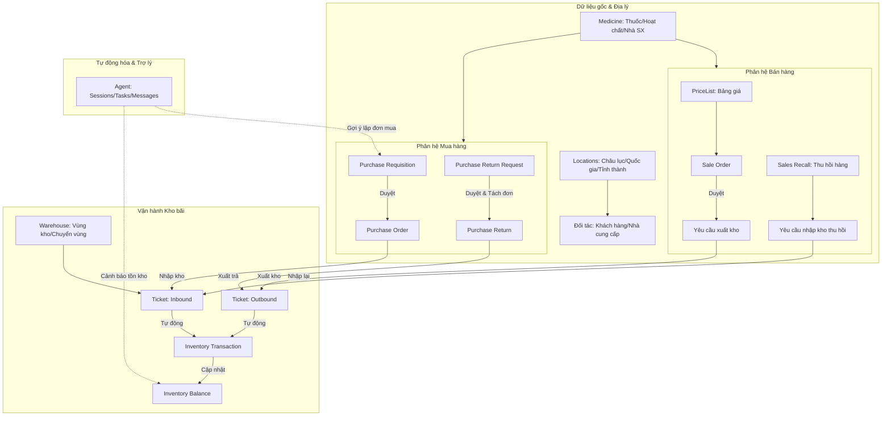

# Đặc tả Kiến trúc Nghiệp vụ (Business Architecture Specification) - SupplyCoreERP

Tài liệu này mô tả chi tiết **Kiến trúc Nghiệp vụ (Business Architecture)** của hệ thống **SupplyCoreERP** theo phương pháp luận **TOGAF (Phase B)**, phản ánh đầy đủ các phân hệ và luồng nghiệp vụ được thiết lập trong mã nguồn dự án.

---

## 1. Tác nhân & Vai trò nghiệp vụ (Actors & Business Roles)

Hệ thống định nghĩa các nhóm đối tượng sử dụng với nhiệm vụ và quyền hạn tương ứng trong chuỗi cung ứng vật tư/dược phẩm:

| Vai trò nghiệp vụ | Mô tả chức năng | Quyền hạn tương ứng (Permission Group) |
| :--- | :--- | :--- |
| **Quản trị viên (Administrator)** | Thiết lập cấu hình hệ thống, quản lý người dùng và phân bổ vai trò. | Toàn quyền (`*`) |
| **Quản lý danh mục (Catalog Manager)** | Đảm bảo tính chuẩn hóa của thông tin thuốc, hoạt chất, quy cách đóng gói và phê duyệt đưa sản phẩm vào kinh doanh. | `Catalog` |
| **Nhân viên Mua hàng (Purchasing Officer)** | Quản lý mối quan hệ nhà cung cấp, lập kế hoạch mua hàng (PR/PO) và xử lý quy trình xuất trả hàng lỗi (PRR/Purchase Return). | `Partner.Supplier`, `Order.PurchaseRequisition`, `Order.PurchaseOrder`, `Order.PurchaseReturn` |
| **Thủ kho / Nhân viên kho (Warehouse Keeper)** | Vận hành kho vật lý, kiểm soát nhập/xuất kho (`Ticket`), quản lý số lô/hạn dùng (`Batch`) và điều chuyển vị trí lưu trữ (`Zone Transfer`). | `Inventory.Warehouse`, `Inventory.Batch`, `Inventory.Ticket` |
| **Nhân viên Bán hàng (Sales Officer)** | Tiếp nhận đơn đặt hàng từ khách hàng (`Sale Order`), quản lý thông tin khách hàng và giải quyết các trường hợp thu hồi sản phẩm (`Sales Recall`). | `Partner.Customer`, `Order.SaleOrder`, `Order.SalesRecall` |
| **Trợ lý thông minh (AI Agent)** | Phân tích tự động, cảnh báo mức tồn kho, hỗ trợ tìm kiếm và thực thi tự động một số luồng nghiệp vụ lặp đi lặp lại. | Đọc và xử lý tự động (`AgentSession`, `AgentTask`) |

---

## 2. Quy trình nghiệp vụ cốt lõi (Core Business Processes)

Hệ thống vận hành xoay quanh 6 luồng quy trình chính liên kết chặt chẽ với nhau:

### 2.1. Quy trình Chuẩn hóa Danh mục Sản phẩm (Catalog Standardization)
1.  **Khởi tạo:** Nhân viên danh mục tạo mới thuốc kèm theo thông tin chi tiết (Tên, đơn vị tính, dạng bào chế, hoạt chất, nhà sản xuất).
2.  **Kiểm duyệt:** Bộ phận quản lý kiểm tra và duyệt thông tin thuốc (`Approve Medicine`). Chỉ những thuốc đã duyệt mới được sử dụng trong các giao dịch mua bán và lưu trữ kho.

### 2.2. Quy trình Cung ứng và Nhập kho (Procurement to Inbound - P2P)
1.  **Đề xuất:** Các bộ phận lập Yêu cầu mua hàng (`Purchase Requisition`).
2.  **Đặt hàng:** Sau khi PR được duyệt, Nhân viên mua hàng chuyển đổi thành Đơn mua hàng (`Purchase Order`) chính thức gửi Nhà cung cấp.
3.  **Nhập kho:** Khi hàng về tới kho, Thủ kho đối chiếu PO để tạo phiếu Nhập kho (`Ticket` - Type: Inbound), ghi nhận số lô và hạn sử dụng (`Batch`) của từng sản phẩm.
4.  **Cập nhật số dư:** Phê duyệt phiếu Nhập kho sẽ tự động tạo Giao dịch kho (`Inventory Transaction`) và tăng Số dư tồn kho (`Inventory Balance`) tương ứng.

### 2.3. Quy trình Bán hàng và Xuất kho (Order to Outbound - O2C)
1.  **Lập đơn:** Nhân viên bán hàng tiếp nhận yêu cầu từ khách hàng và lập Đơn bán hàng (`Sale Order`). Hệ thống áp dụng chính sách giá từ Bảng giá phù hợp (`Price List`).
2.  **Xuất kho:** Sau khi SO được duyệt, Thủ kho lập phiếu Xuất kho (`Ticket` - Type: Outbound), chọn đúng sản phẩm theo nguyên tắc quản lý số lô/hạn dùng (FIFO/FEFO).
3.  **Giao hàng:** Phê duyệt phiếu Xuất kho ghi giảm tồn kho thực tế và chuyển giao cho bộ phận vận chuyển giao tới địa chỉ khách hàng dựa trên cấu trúc Địa lý (`Locations`).

### 2.4. Quy trình Trả hàng Nhà cung cấp (Purchase Return)
1.  **Đề xuất:** Nhân viên mua hàng lập Yêu cầu trả hàng (`Purchase Return Request`) chỉ định rõ trả từ PO nào, sản phẩm, lô hàng và lý do trả hàng (Lỗi hỏng/Thương mại).
2.  **Phê duyệt & Tách đơn:** Người quản lý phê duyệt PRR. Hệ thống tự động gom nhóm các dòng hàng theo cặp `{PurchaseOrderId, ReturnType}` để tách thành các phiếu Xuất trả (`Purchase Return`) tương ứng cho từng Nhà cung cấp.
3.  **Thực thi:** Thủ kho chuẩn bị hàng, tạo phiếu Xuất kho liên kết với phiếu `Purchase Return` để giảm trừ tồn kho vật lý và ghi giảm công nợ với Nhà cung cấp.

### 2.5. Quy trình Thu hồi hàng bán từ Khách hàng (Sales Recall)
1.  **Tiếp nhận:** Nhân viên bán hàng tạo phiếu Yêu cầu thu hồi hàng bán (`Sales Recall`) khi khách hàng phản hồi sản phẩm lỗi hoặc trả lại hàng thương mại.
2.  **Nhập kho thu hồi:** Sau khi duyệt yêu cầu, Thủ kho lập phiếu Nhập kho thu hồi để chuyển hàng vào vùng cách ly kiểm tra chất lượng trước khi quyết định tái nhập kho hay hủy bỏ.

### 2.6. Quy trình Tự động hóa và Trợ lý ảo (AI Agent System)
1.  **Thiết lập:** Hệ thống khởi chạy các phiên làm việc của trợ lý ảo (`AgentSession`).
2.  **Lập lịch:** Giao các nhiệm vụ tự động hóa (`AgentTask`) cho Agent (ví dụ: quét hạn dùng lô hàng, phân tích công nợ quá hạn).
3.  **Tương tác:** Agent gửi thông điệp (`AgentMessage`) cảnh báo hoặc đề xuất hành động trực tiếp cho người dùng trên giao diện.

---

## 3. Sơ đồ Luồng Nghiệp vụ tổng thể

---

## 4. Bản đồ thực thể thông tin nghiệp vụ (Business Entities Map)

Các thực thể trong mã nguồn được phân nhóm tương ứng với các cấu phần kiến trúc nghiệp vụ:

### 4.1. Nhóm thực thể Danh mục sản phẩm (Catalog Domain)
*   [Medicine.cs](file:///D:/ProjectOwner/SupplyCoreERP/src/SupplyCoreERP.Domain/Catalog/Medicines/Medicine.cs): Thông tin chi tiết về sản phẩm/thuốc.
*   [Category.cs](file:///D:/ProjectOwner/SupplyCoreERP/src/SupplyCoreERP.Domain/Catalog/Categories/Category.cs): Danh mục phân loại sản phẩm.
*   [ActiveIngredient.cs](file:///D:/ProjectOwner/SupplyCoreERP/src/SupplyCoreERP.Domain/Catalog/ActiveIngredients/ActiveIngredient.cs): Thông tin hoạt chất của thuốc.
*   [DosageForm.cs](file:///D:/ProjectOwner/SupplyCoreERP/src/SupplyCoreERP.Domain/Catalog/DosageForms/DosageForm.cs): Dạng bào chế thuốc.
*   [Manufacturer.cs](file:///D:/ProjectOwner/SupplyCoreERP/src/SupplyCoreERP.Domain/Catalog/Manufacturers/Manufacturer.cs): Nhà sản xuất sản phẩm.

### 4.2. Nhóm thực thể Đối tác & Địa lý (Partner & Geography Domain)
*   [Customer.cs](file:///D:/ProjectOwner/SupplyCoreERP/src/SupplyCoreERP.Domain/Partner/Customers/Customer.cs): Khách hàng.
*   [Supplier.cs](file:///D:/ProjectOwner/SupplyCoreERP/src/SupplyCoreERP.Domain/Partner/Suppliers/Supplier.cs): Nhà cung cấp.
*   [City.cs](file:///D:/ProjectOwner/SupplyCoreERP/src/SupplyCoreERP.Domain/Locations/Cities/City.cs) / [Area.cs](file:///D:/ProjectOwner/SupplyCoreERP/src/SupplyCoreERP.Domain/Locations/Areas/Area.cs): Thông tin địa lý phục vụ tuyến đường giao nhận.

### 4.3. Nhóm thực thể Kho vận (Inventory Domain)
*   [Warehouse.cs](file:///D:/ProjectOwner/SupplyCoreERP/src/SupplyCoreERP.Domain/Inventory/Warehouses/Warehouse.cs): Cấu trúc kho hàng và các phân vùng.
*   [Batch.cs](file:///D:/ProjectOwner/SupplyCoreERP/src/SupplyCoreERP.Domain/Inventory/Batches/Batch.cs): Lô sản xuất và hạn dùng sản phẩm.
*   [Ticket.cs](file:///D:/ProjectOwner/SupplyCoreERP/src/SupplyCoreERP.Domain/Inventory/Tickets/Ticket.cs): Phiếu kho (Nhập/Xuất/Kiểm kê).
*   [Balance.cs](file:///D:/ProjectOwner/SupplyCoreERP/src/SupplyCoreERP.Domain/Inventory/Balances/Balance.cs): Số dư tồn kho thực tế.
*   [Transaction.cs](file:///D:/ProjectOwner/SupplyCoreERP/src/SupplyCoreERP.Domain/Inventory/Transactions/Transaction.cs): Lịch sử biến động kho.

### 4.4. Nhóm thực thể Đơn hàng & Chứng từ (Order Domain)
*   [PurchaseRequisition.cs](file:///D:/ProjectOwner/SupplyCoreERP/src/SupplyCoreERP.Domain/Procurement/PurchaseRequisitions/PurchaseRequisition.cs): Yêu cầu mua hàng.
*   [PurchaseOrder.cs](file:///D:/ProjectOwner/SupplyCoreERP/src/SupplyCoreERP.Domain/Procurement/PurchaseOrders/PurchaseOrder.cs): Đơn mua hàng.
*   [SaleOrder.cs](file:///D:/ProjectOwner/SupplyCoreERP/src/SupplyCoreERP.Domain/Sales/SalesOrders/SaleOrder.cs): Đơn bán hàng.
*   [PriceList.cs](file:///D:/ProjectOwner/SupplyCoreERP/src/SupplyCoreERP.Domain/Sales/PriceLists/PriceList.cs): Bảng giá sản phẩm.
*   [PurchaseReturnRequest.cs](file:///D:/ProjectOwner/SupplyCoreERP/src/SupplyCoreERP.Domain/Procurement/PurchaseReturnRequests/PurchaseReturnRequest.cs): Yêu cầu xuất trả hàng lỗi.
*   [PurchaseReturn.cs](file:///D:/ProjectOwner/SupplyCoreERP/src/SupplyCoreERP.Domain/Procurement/PurchaseReturns/PurchaseReturn.cs): Chứng từ xuất trả nhà cung cấp chính thức.
*   [SalesRecall.cs](file:///D:/ProjectOwner/SupplyCoreERP/src/SupplyCoreERP.Domain/Sales/SalesRecalls/SalesRecall.cs): Phiếu thu hồi hàng bán từ khách hàng.

### 4.5. Nhóm thực thể Trợ lý thông minh (AI Agent Domain)
*   [AgentSession.cs](file:///D:/ProjectOwner/SupplyCoreERP/src/SupplyCoreERP.Domain/Agent/AgentSession.cs): Phiên làm việc của AI Agent.
*   [AgentTask.cs](file:///D:/ProjectOwner/SupplyCoreERP/src/SupplyCoreERP.Domain/Agent/AgentTask.cs): Các công việc được AI tự động thực hiện.
*   [AgentMessage.cs](file:///D:/ProjectOwner/SupplyCoreERP/src/SupplyCoreERP.Domain/Agent/AgentMessage.cs): Tin nhắn và cảnh báo từ AI gửi tới người vận hành.
