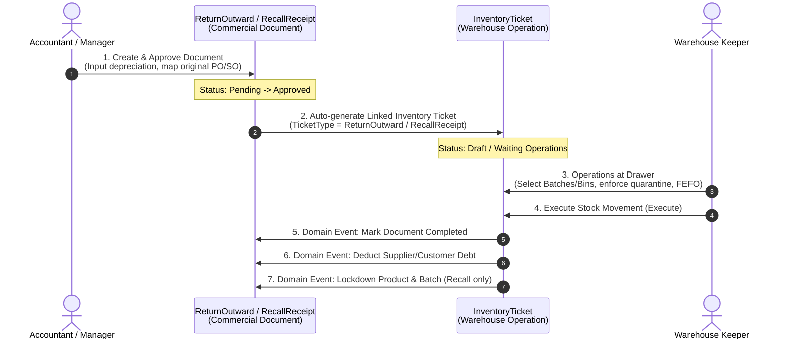

# Technical Design Specification: ReturnOutward and RecallReceipt Modules

## 1. Introduction & Objectives
This document specifies the technical design for implementing two major supply chain modules in SupplyCoreERP:
* **ReturnOutward (Supplier Returns)**: Managing the process of returning goods to suppliers, commercial negotiation (depreciation), cumulative validation, and financial debt reconciliation.
* **RecallReceipt (Product Recalls)**: Managing the traceability, quarantine, lockdown, and customer debt deduction for quality-compromised products based on government regulatory instructions.

Both modules are designed under **Clean Architecture** and **Domain-Driven Design (DDD)** principles using the **ABP Framework (10.0)**. They maintain a strict separation between **Commercial/Administrative Documents** and **Warehouse Operations (Inventory Tickets)**.

---

## 2. Business Flow & Use Cases

### 2.1 ReturnOutward (Supplier Returns)
1. **Creation**: Accountants create a `ReturnOutward` document in `Draft` status, specifying `SupplierId`, `WarehouseId`, and a completed `PurchaseOrderId`.
2. **Line Selection**: Select lines from the associated PO. The system calculates the maximum allowable return quantity through cumulative limits.
3. **Depreciation Management**: Optional `DepreciationRate (%)` is applied. System calculates `ReturnUnitPrice = OriginalUnitPrice * (1 - DepreciationRate / 100)`.
4. **Submission**: User sends the document to approval (`PendingApproval`), locking the return quota.
5. **Approval**: Warehouse Manager approves the document (`Approved`). The system automatically spawns a linked `InventoryTicket` with `TicketType = ReturnOutward` in `Draft` status.
6. **Execution**: Warehouse Keeper performs physical packaging, allocates batches/bins, and clicks **Execute (ExecuteStockMovementAsync)**. 
7. **Automatic Settlement**: Upon successful execution, a domain event is triggered:
   * Sets `ReturnOutward` status to `Completed`.
   * Automatically reduces Supplier's payable debt: `Supplier.CurrentDebt -= ReturnOutward.TotalAmount`.
   * Deducts warehouse inventory.

### 2.2 RecallReceipt (Product Recalls)
1. **Traceability & Initialization**: Upon receiving a regulatory batch recall notice:
   * Accountants search the compromised `ProductBatchId` using the **Batch Traceability API**.
   * The system lists all `SalesOrders` and `Customers` who purchased this batch.
   * Prompts creation of bulk `RecallReceipt` documents in `Draft` status.
2. **Submission & Approval**: Accountant inputs the `RecallDecisionNumber` and sends to approval $\rightarrow$ Manager approves $\rightarrow$ Automatically spawns a linked `InventoryTicket` (`TicketType = RecallReceipt` in `Draft` status).
3. **Quarantine & Execution**: Warehouse Keeper receives returned compromised items. The system **strictly enforces** placing returned goods into a dedicated **Recall Zone / Recall Bin** for physical quarantine.
4. **Automatic Settlement**: Keeper clicks **Execute on the ticket**:
   * Sets `RecallReceipt` status to `Completed`.
   * Reduces Customer's receivable debt: `Customer.CurrentDebt -= RecallReceipt.TotalAmount` (based on original SO unit price).
   * **Instant Lockdown**: Automatically deactivates the product (`Product.IsAvailableForInventory = false`) and rejects the batch (`ProductBatch.Status = QAStatus.Rejected`) on the entire platform.

---

## 3. High-Level Architecture & Data Flow



---

## 4. Data Model Design (Schema)

### 4.1 Enums (`SupplyCoreERP.Enums.Orders`)
```csharp
public enum ReturnOutwardStatus
{
    Draft = 0,
    PendingApproval = 1,
    Approved = 2,
    Completed = 3,
    Canceled = 4
}

public enum RecallReceiptStatus
{
    Draft = 0,
    PendingApproval = 1,
    Approved = 2,
    Completed = 3,
    Canceled = 4
}
```

### 4.2 ReturnOutward Entities (`Procurement/SupplierReturns`)
```csharp
public class ReturnOutward : FullAuditedAggregateRoot<Guid>
{
    public string Code { get; private set; }
    public Guid PurchaseOrderId { get; private set; }
    public Guid SupplierId { get; private set; }
    public Guid WarehouseId { get; private set; }
    public DateTime ReturnDate { get; private set; }
    public ReturnOutwardStatus Status { get; private set; }
    public decimal SubTotal { get; private set; }
    public decimal TaxAmount { get; private set; }
    public decimal TotalAmount { get; private set; }
    public string? Note { get; private set; }
    public virtual ICollection<ReturnOutwardLine> Lines { get; private set; }
}

public class ReturnOutwardLine : AuditedEntity<Guid>
{
    public Guid ReturnOutwardId { get; private set; }
    public Guid PurchaseOrderLineId { get; private set; }
    public Guid ProductId { get; private set; }
    public Guid UnitId { get; private set; }
    public int ConversionFactor { get; private set; }
    public decimal Quantity { get; private set; }
    public decimal BaseQuantity => Quantity * ConversionFactor;
    public decimal OriginalUnitPrice { get; private set; }
    public decimal DepreciationRate { get; private set; } // Percentage (e.g. 20%)
    public decimal ReturnUnitPrice => OriginalUnitPrice * (1 - DepreciationRate / 100);
    public decimal TaxRate { get; private set; }
    public decimal TotalPrice => Quantity * ReturnUnitPrice;
    public decimal TaxAmount => TotalPrice * (TaxRate / 100);
    public decimal FinalPrice => TotalPrice + TaxAmount;
}
```

### 4.3 RecallReceipt Entities (`Sales/ProductRecalls`)
```csharp
public class RecallReceipt : FullAuditedAggregateRoot<Guid>
{
    public string Code { get; private set; }
    public Guid SalesOrderId { get; private set; }
    public Guid CustomerId { get; private set; }
    public Guid WarehouseId { get; private set; }
    public DateTime RecallDate { get; private set; }
    public string RecallDecisionNumber { get; private set; }
    public RecallReceiptStatus Status { get; private set; }
    public decimal TotalAmount { get; private set; }
    public string? Note { get; private set; }
    public virtual ICollection<RecallReceiptLine> Lines { get; private set; }
}

public class RecallReceiptLine : AuditedEntity<Guid>
{
    public Guid RecallReceiptId { get; private set; }
    public Guid SalesOrderLineId { get; private set; }
    public Guid ProductId { get; private set; }
    public Guid UnitId { get; private set; }
    public int ConversionFactor { get; private set; }
    public decimal Quantity { get; private set; }
    public decimal BaseQuantity => Quantity * ConversionFactor;
    public decimal OriginalUnitPrice { get; private set; }
    public decimal TaxRate { get; private set; }
    public decimal TotalPrice => Quantity * OriginalUnitPrice;
    public decimal TaxAmount => TotalPrice * (TaxRate / 100);
    public decimal FinalPrice => TotalPrice + TaxAmount;
}
```

---

## 5. API Endpoint Specifications

### 5.1 `ReturnOutwardAppService`
* `GET /api/app/return-outward/lines-from-po/{poId}`
  * Purpose: Get selectabe lines from PO with dynamic remaining return quantity (excluding already returned items).
* `POST /api/app/return-outward`
  * Body: `CreateReturnOutwardDto`
  * Purpose: Create a Draft Return Outward document.
* `PUT /api/app/return-outward/{id}`
  * Body: `UpdateReturnOutwardDto`
  * Purpose: Update Draft document.
* `POST /api/app/return-outward/{id}/send-to-approve`
  * Purpose: Lock quota, validate inventory balances, change status to `PendingApproval`.
* `POST /api/app/return-outward/{id}/approve`
  * Purpose: Change status to `Approved` and **auto-trigger `InventoryTicket` creation** (`TicketType.ReturnOutward`).
* `POST /api/app/return-outward/{id}/reject`
  * Purpose: Change status back to `Draft`, release temporary locked quota.

### 5.2 `RecallReceiptAppService`
* `GET /api/app/recall-receipt/trace-by-batch/{batchId}`
  * Purpose: Perform traceability scan on `InventoryTransaction` to list affected customers/sales orders.
* `POST /api/app/recall-receipt`
  * Body: `CreateRecallReceiptDto`
* `POST /api/app/recall-receipt/{id}/send-to-approve`
* `POST /api/app/recall-receipt/{id}/approve`
  * Purpose: Auto-trigger `InventoryTicket` creation (`TicketType.RecallReceipt`).

---

## 6. Business Validation Rules (Hard-Gates)

### 6.1 Cumulative Returns Validation
Before saving or submitting a `ReturnOutwardLine` or `RecallReceiptLine`, the system must run a database check:
```csharp
// For ReturnOutward:
decimal alreadyReturned = await _returnOutwardLineRepository
    .Where(x => x.PurchaseOrderLineId == poLineId && x.ReturnOutward.Status != ReturnOutwardStatus.Canceled)
    .SumAsync(x => x.Quantity * x.ConversionFactor);

if (alreadyReturned + (newQty * conversionFactor) > poLine.BaseQuantity)
{
    throw new BusinessException("SupplyCoreERP:ReturnQuantityExceedsLimit", "Tổng số lượng xuất trả vượt quá số lượng đã nhận trên PO gốc!");
}
```

### 6.2 Recall Zone Isolation Rule
Inside `TicketManager.cs` during `CreateTicketDetailAsync` for `TicketType == TicketType.RecallReceipt`, quarantine must be strictly enforced:
```csharp
if (ticket.Type == TicketType.RecallReceipt)
{
    Zone zone = await _zoneRepository.GetAsync(bin.ZoneId);
    if (!zone.IsRecallZone) // Enforced special flag on Zone
    {
        throw new BusinessException("SupplyCoreERP:QuarantineEnforced", "Sản phẩm thu hồi bắt buộc phải đưa vào Vùng Biệt Trữ Cách Ly (Recall Zone)!");
    }
}
```

---

## 7. Event-Driven Post-Execution Handlers

Upon successfully executing the `InventoryTicket` (marked `Executed` in stock balances), `InventoryTicketExecutedDomainEvent` is published:

### 7.1 `ReturnOutwardTicketExecutedEventHandler`
```csharp
public async Task HandleEventAsync(InventoryTicketExecutedDomainEvent eventData)
{
    if (eventData.TicketType != TicketType.ReturnOutward || !eventData.ReferenceDocumentId.HasValue) return;

    Guid roId = eventData.ReferenceDocumentId.Value;
    ReturnOutward ro = await _returnOutwardRepository.GetAsync(roId);
    ro.Complete(); // Update Status to Completed

    Supplier supplier = await _supplierRepository.GetAsync(ro.SupplierId);
    supplier.AddDebt(-ro.TotalAmount); // Automatically deduct supplier payable debt

    await _returnOutwardRepository.UpdateAsync(ro);
    await _supplierRepository.UpdateAsync(supplier);
}
```

### 7.2 `RecallReceiptTicketExecutedEventHandler`
```csharp
public async Task HandleEventAsync(InventoryTicketExecutedDomainEvent eventData)
{
    if (eventData.TicketType != TicketType.RecallReceipt || !eventData.ReferenceDocumentId.HasValue) return;

    Guid recallId = eventData.ReferenceDocumentId.Value;
    RecallReceipt rr = await _recallReceiptRepository.GetAsync(recallId);
    rr.Complete(); // Update Status to Completed

    Customer customer = await _customerRepository.GetAsync(rr.CustomerId);
    customer.AddDebt(-rr.TotalAmount); // Automatically deduct customer receivable debt

    // LOCKDOWN COMPROMISED MEDICINE AND BATCHES PLATFORM-WIDE
    foreach (var line in rr.Lines)
    {
        Product product = await _productRepository.GetAsync(line.ProductId);
        product.Deactivate(); // Product.IsAvailableForInventory = false

        List<Guid> batchIds = eventData.Lines
            .Where(x => x.ProductId == line.ProductId)
            .SelectMany(x => x.Details.Select(d => d.ProductBatchId))
            .Distinct()
            .ToList();

        List<ProductBatch> batches = await _batchRepository.GetListAsync(x => batchIds.Contains(x.Id));
        foreach (var b in batches)
        {
            b.RejectQA(); // ProductBatch.Status = QAStatus.Rejected
        }
        await _batchRepository.UpdateManyAsync(batches);
        await _productRepository.UpdateAsync(product);
    }

    await _recallReceiptRepository.UpdateAsync(rr);
    await _customerRepository.UpdateAsync(customer);
}
```
