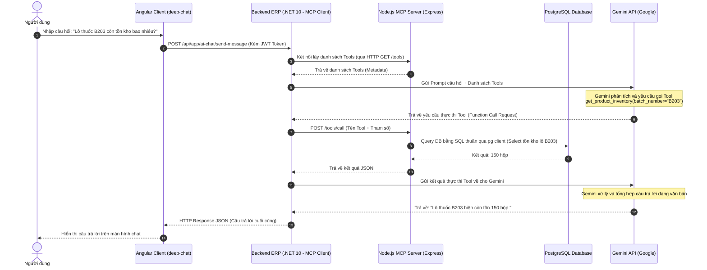

# Tài liệu Thiết kế: Trợ lý AI Chat Assistant (RAG & TypeScript MCP Server Integration)

Tài liệu này mô tả chi tiết thiết kế kiến trúc, luồng dữ liệu và kế hoạch triển khai tính năng Trợ lý AI (AI Chat Assistant) hỗ trợ tra cứu dữ liệu thời gian thực (RAG) sử dụng **Gemini API** kết hợp giao thức **MCP (Model Context Protocol)** với một **TypeScript (Node.js) MCP Server độc lập**.

Sự phân tách này giúp chuẩn hóa kiến trúc AI Agent của doanh nghiệp, đáp ứng tốt yêu cầu phân rã hệ thống của Đồ án tốt nghiệp, đồng thời tối ưu hóa tài nguyên (RAM/CPU) để deploy mượt mà trên **Railway** mà không lo bị lỗi tràn bộ nhớ (OOM).

---

## 1. Kiến trúc Tổng thể & Phân vai (Architecture)

Hệ thống được chia làm 3 thành phần chính hoạt động độc lập:

1.  **Frontend (Angular Client)**: Hiển thị giao diện Chat Widget (`<deep-chat>`), gửi/nhận tin nhắn qua HTTP POST REST API tới Backend C#.
2.  **Backend ERP (C# .NET 10 - MCP Client)**:
    *   Lưu trữ an toàn Gemini API Key.
    *   Đóng vai trò là **MCP Client** kết nối tới Node.js MCP Server qua giao thức mạng HTTP/SSE.
    *   Điều phối vòng lặp gọi hàm (Function Calling Loop) với Gemini.
3.  **AI Gateway (Node.js TypeScript - MCP Server)**:
    *   Dịch vụ độc lập viết bằng **TypeScript** (sử dụng Express và SDK `@modelcontextprotocol/sdk` chính thức).
    *   Expose các công cụ tra cứu dữ liệu dưới dạng các **MCP Tools**.
    *   Kết nối trực tiếp vào Database PostgreSQL (sử dụng thư viện `pg`) để thực thi truy vấn.

### Sơ đồ kiến trúc & Luồng dữ liệu (Data Flow):


---

## 2. Thiết kế Tầng Backend ERP (C# .NET 10 - MCP Client)

Backend C# sử dụng HttpClient để kết nối tới REST API của Gemini và duy trì kết nối HTTP/SSE tới Node.js MCP Server.

### 2.1. Cấu hình biến môi trường (Configuration)
Khai báo trong file `appsettings.json` hoặc Environment Variables của Railway:
```json
{
  "Gemini": {
    "ApiKey": "YOUR_GEMINI_API_KEY",
    "Model": "gemini-1.5-pro"
  },
  "McpServer": {
    "BaseUrl": "http://localhost:3000" // URL của Node.js MCP Server
  }
}
```

### 2.2. Application Service Interface & DTOs
Định nghĩa trong project `SupplyCoreERP.Application.Contracts`:

```csharp
namespace SupplyCoreERP.AiChats.Dtos;

public class ChatMessageDto
{
    public string Role { get; set; } // "user" hoặc "model"
    public string Text { get; set; }
}

public class ChatRequestInputDto
{
    [Required]
    public string Text { get; set; }
    public List<ChatMessageDto> History { get; set; } = new();
}

public class ChatResponseOutputDto
{
    public string Text { get; set; }
}
```

*   **`IAiChatAppService.cs`**:
    ```csharp
    using System.Threading.Tasks;
    using SupplyCoreERP.AiChats.Dtos;
    using Volo.Abp.Application.Services;

    namespace SupplyCoreERP.AiChats;

    public interface IAiChatAppService : IApplicationService
    {
        Task<ChatResponseOutputDto> SendMessageAsync(ChatRequestInputDto input);
    }
    ```

### 2.3. Triển khai `AiChatAppService.cs` (.Application Layer)
```csharp
using System.Threading.Tasks;
using Microsoft.AspNetCore.Authorization;
using SupplyCoreERP.AiChats.Dtos;
using SupplyCoreERP.AiChats.Mcp;

namespace SupplyCoreERP.AiChats;

[Authorize]
public class AiChatAppService : SupplyCoreERPAppService, IAiChatAppService
{
    private readonly IMcpClientService _mcpClientService;

    public AiChatAppService(IMcpClientService mcpClientService)
    {
        _mcpClientService = mcpClientService;
    }

    public async Task<ChatResponseOutputDto> SendMessageAsync(ChatRequestInputDto input)
    {
        var responseText = await _mcpClientService.ExecuteConversationAsync(input.Text, input.History);
        return new ChatResponseOutputDto { Text = responseText };
    }
}
```

---

## 3. Thiết kế Dự án Node.js MCP Server (TypeScript)

Dự án MCP Server được viết bằng **TypeScript** sử dụng thư viện chính thức `@modelcontextprotocol/sdk`.

### 3.1. Cấu trúc thư mục dự án (`mcp-server/`)
```text
mcp-server/
├── src/
│   ├── index.ts          # Khởi chạy server & SSE Transport
│   ├── db.ts             # Kết nối Database PostgreSQL (node-postgres)
│   └── tools.ts          # Định nghĩa danh sách MCP Tools
├── package.json          # Quản lý dependencies
├── tsconfig.json         # Cấu hình TypeScript compiler
└── tsconfig.build.json
```

### 3.2. Cài đặt các thư viện chính (`package.json`)
```json
{
  "dependencies": {
    "@modelcontextprotocol/sdk": "^0.1.0",
    "express": "^4.19.0",
    "pg": "^8.11.0",
    "dotenv": "^16.4.0"
  },
  "devDependencies": {
    "@types/express": "^4.17.0",
    "@types/node": "^20.11.0",
    "@types/pg": "^8.11.0",
    "typescript": "^5.3.0"
  }
}
```

### 3.3. Định nghĩa Tools trong TypeScript (`src/tools.ts`)
Sử dụng SDK để khai báo các Tools:

```typescript
import { CallToolRequest, ListToolsRequest } from "@modelcontextprotocol/sdk/types.js";
import { queryDb } from "./db.js";

// 1. Định nghĩa metadata gửi cho Gemini
export const getToolsDefinition = () => {
  return [
    {
      name: "get_inventory_balance",
      description: "Tra cứu số lượng tồn kho thực tế của sản phẩm theo mã sản phẩm hoặc mã kho.",
      inputSchema: {
        type: "object",
        properties: {
          productCode: { type: "string", description: "Mã sản phẩm cần tra cứu" },
          warehouseCode: { type: "string", description: "Mã kho cần lọc (tùy chọn)" }
        },
        required: ["productCode"]
      }
    }
  ];
};

// 2. Hàm thực thi logic truy vấn database
export const executeTool = async (name: string, args: any) => {
  if (name === "get_inventory_balance") {
    const { productCode, warehouseCode } = args;
    
    let query = `
      SELECT w."Name" as "WarehouseName", b."Quantity", p."Name" as "ProductName"
      FROM "AppInventoryBalances" b
      JOIN "AppProducts" p ON b."ProductId" = p."Id"
      JOIN "AppWarehouses" w ON b."WarehouseId" = w."Id"
      WHERE p."Code" = $1
    `;
    const params = [productCode];
    
    if (warehouseCode) {
      query += ` AND w."Code" = $2`;
      params.push(warehouseCode);
    }
    
    const rows = await queryDb(query, params);
    if (rows.length === 0) {
      return {
        content: [{ type: "text", text: `Không tìm thấy tồn kho cho sản phẩm ${productCode}.` }]
      };
    }
    
    const text = rows.map((r: any) => `Kho: ${r.WarehouseName} | Tồn kho: ${r.Quantity} | Tên SP: ${r.ProductName}`).join("\n");
    return {
      content: [{ type: "text", text }]
    };
  }
  
  throw new Error(`Tool ${name} không tồn tại.`);
};
```

---

## 4. Tích hợp Frontend Angular
Giữ nguyên thiết kế kết nối HTTP POST REST API tới `/api/app/ai-chat/send-message` kèm theo token như đã chốt.

---

## 5. Kế hoạch Triển khai Chi tiết (Implementation Plan)

### Giai đoạn 1: Xây dựng dự án Node.js MCP Server (TypeScript)
1.  Tạo thư mục `mcp-server-node/` trong workspace.
2.  Cấu hình kết nối PostgreSQL Neon Cloud thông qua biến môi trường.
3.  Viết code các Tools tra cứu cơ bản: Tồn kho (`get_inventory_balance`), Đơn mua PO (`get_purchase_order_details`).
4.  Thiết lập Express Server với SSE Transport để expose API chuẩn MCP.

### Giai đoạn 2: Tích hợp MCP Client vào C# Backend
1.  Tạo DTOs và interface `IAiChatAppService` ở project Contracts.
2.  Viết Service `McpClientService` sử dụng HttpClient để gọi song song:
    *   Kết nối SSE tới Node.js MCP Server để lấy danh sách Tools.
    *   Gửi request đến Gemini API.
    *   Nếu Gemini yêu cầu gọi hàm, chuyển tiếp request thực thi Tool sang Node.js MCP Server và trả kết quả về cho Gemini.
3.  Triển khai `AiChatAppService.cs`.

### Giai đoạn 3: Cập nhật Frontend Angular & Test toàn trình
1.  Cập nhật logic `ai-chat.component.ts` để kết nối API thực tế của C# Backend kèm JWT Token.
2.  Chạy thử nghiệm toàn trình (E2E) và kiểm tra luồng chat AI tra cứu database.
3.  Cấu hình deploy Node.js MCP Server lên Railway dưới dạng 1 Service riêng biệt (rất nhẹ, chạy chỉ tốn khoảng 40MB RAM).
