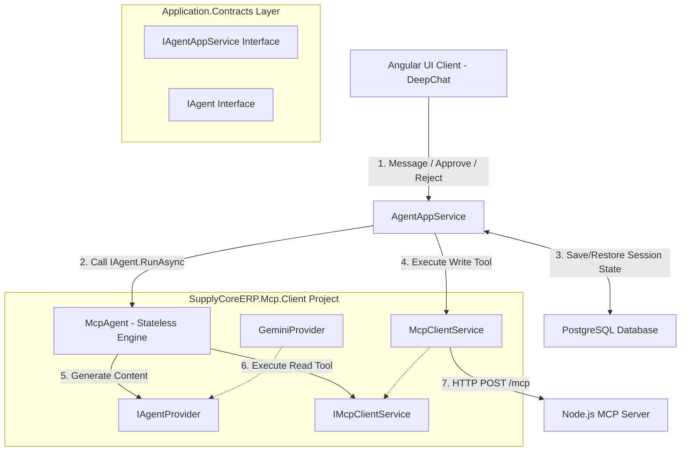
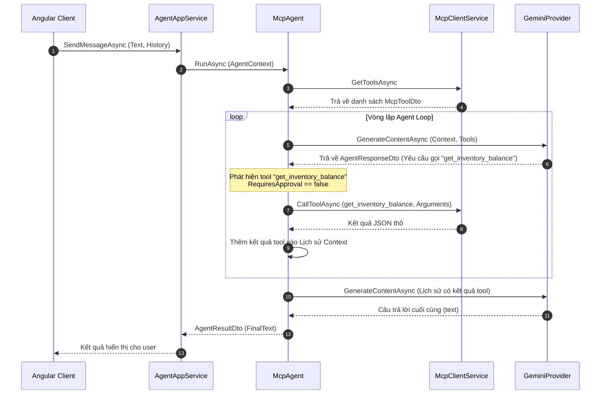
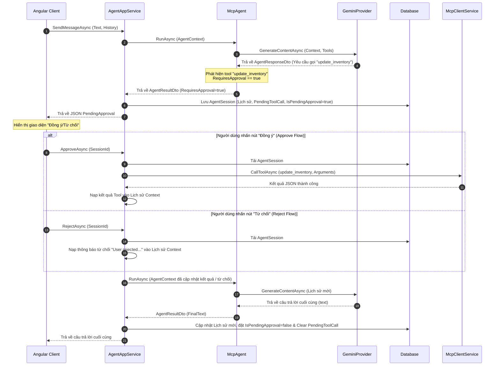
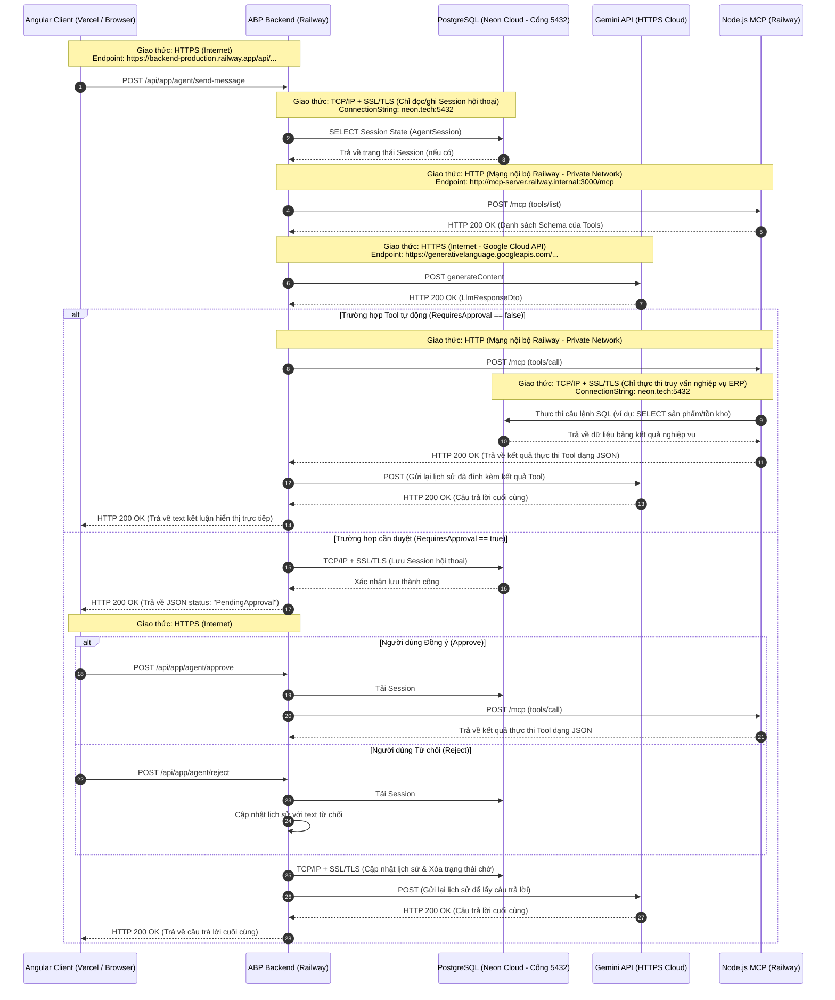

# Tài liệu Đặc tả Thiết kế Tái cấu trúc C# MCP Host Client - SupplyCoreERP (Kiến trúc AI Agent Stateless)

Tài liệu này đặc tả chi tiết kiến trúc và thiết kế kỹ thuật để tái cấu trúc C# MCP Client trong dự án `SupplyCoreERP`. Thiết kế này áp dụng **Stateless Agent Pattern** theo tiêu chuẩn MCP, đóng gói toàn bộ logic Agent Loop và khả năng tích hợp AI bên trong project `SupplyCoreERP.Mcp.Client` dưới tên gọi `McpAgent` hoàn toàn không có trạng thái (Stateless). Tầng Application chịu trách nhiệm quản lý trạng thái phiên làm việc (State Persistence) và cung cấp các cổng API công khai (`Approve`, `Reject`).

---

## 1. Bối cảnh và Mục tiêu

### 1.1 Vấn đề hiện tại
- **Tight Coupling**: Phiên bản MCP Client cũ kết dính chặt chẽ cấu trúc dữ liệu LLM (Gemini) ở tầng Application.
- **Tính mở rộng (Scalability)**: Thiết kế cũ trói buộc Agent vào kịch bản Chat tương tác, tự động truy cập database lưu session làm mất khả năng tái sử dụng Agent cho các tác vụ chạy ngầm (Background Jobs) hoặc các kênh khác (Telegram, Webhook).
- **Tránh Flag Arguments**: Việc sử dụng một cờ boolean `Approved` để điều phối cả hai hành động Đồng ý và Từ chối làm mờ ngữ nghĩa của API.

### 1.2 Mục tiêu tái cấu trúc
- **Stateless Agent Engine**: `IAgent` (McpAgent) hoạt động hoàn toàn không trạng thái. Đầu vào duy nhất là `AgentContext` (danh sách các bước thực thi) và trả về `AgentResultDto`. Nó không có quyền truy cập hay phụ thuộc vào cơ sở dữ liệu.
- **State Persistence tại Application Layer**: `AgentAppService` chịu trách nhiệm đọc/ghi phiên làm việc (`AgentSession`) từ Database, chuẩn bị `AgentContext` và điều phối luồng API.
- **Explicit API (Tách biệt Approve/Reject)**: Tách biệt hoàn toàn hành động Phê duyệt (`Approve`) và Từ chối (`Reject`) thành hai phương thức API riêng biệt.
- **Human-in-the-loop (HITL)**: Hỗ trợ ngắt luồng gọi tool ghi nhạy cảm để xin phê duyệt từ giao diện thông qua `AgentSession` được quản lý bởi AppService.

---

## 2. Thiết kế Kiến trúc Tổng thể



### 2.1 Trách nhiệm của các thành phần
- **`AgentAppService`** (Application Layer): Quản lý đọc/ghi `AgentSession` từ Database, thực thi các tool ghi nhạy cảm sau khi được duyệt, nạp kết quả hoặc từ chối vào lịch sử hội thoại, và gửi ngữ cảnh hoàn chỉnh sang Agent để tiếp tục chạy.
- **`IAgent` & `McpAgent`** (Stateless Agent Engine): Bộ não điều phối AI. Chạy vòng lặp Agent Loop (Agent Loop), gọi LLM sinh content, tự động gọi các tool MCP không nhạy cảm và trả về kết quả cuối cùng hoặc yêu cầu tạm ngắt xin phê duyệt.
- **`IAgentProvider` & `GeminiProvider`** (Nội bộ `Mcp.Client`): Nhà cung cấp dịch vụ mô hình AI (Gemini).
- **`IMcpClientService` & `McpClientService`** (Nội bộ `Mcp.Client`): Vận chuyển HTTP stateless kết nối với MCP Server.
- **`AgentSession`** (Domain Layer): Thực thể lưu trạng thái phiên làm việc của Agent.

---

## 3. Cấu trúc Cơ sở dữ liệu (Database Schema)

Thực thể `AgentSession` kế thừa từ `CreationAuditedEntity<Guid>` để duy trì ngữ cảnh Agent:

```csharp
using System;
using Volo.Abp.Domain.Entities.Auditing;

namespace SupplyCoreERP.Ai;

public class AgentSession : CreationAuditedEntity<Guid>
{
    public Guid UserId { get; set; }
    
    /// <summary>
    /// Chuỗi JSON lưu trữ danh sách các đối tượng AgentChatMessageDto đại diện cho lịch sử hội thoại của Agent.
    /// </summary>
    public string ConversationHistoryJson { get; set; }
    
    /// <summary>
    /// Đánh dấu phiên làm việc này có đang bị tạm dừng chờ người dùng phê duyệt hay không.
    /// </summary>
    public bool IsPendingApproval { get; set; }
    
    /// <summary>
    /// Chuỗi JSON lưu trữ thông tin của Tool Call đang chờ được thực thi sau khi duyệt.
    /// </summary>
    public string? PendingToolCallJson { get; set; }
}
```

---

## 4. Cấu trúc Interfaces & DTOs (Tầng Contracts - `SupplyCoreERP.Application.Contracts`)

### 4.1 interfaces

```csharp
// Agent/IAgentAppService.cs
using System.Threading.Tasks;
using SupplyCoreERP.Agent.Dtos;
using Volo.Abp.Application.Services;

namespace SupplyCoreERP.Agent;

public interface IAgentAppService : IApplicationService
{
    Task<object> SendMessageAsync(AgentRequestInputDto input);
    Task<object> ApproveAsync(AgentSessionInputDto input);
    Task<object> RejectAsync(AgentSessionInputDto input);
}

// Agent/IAgent.cs
using System.Threading.Tasks;
using SupplyCoreERP.Agent.Dtos;

namespace SupplyCoreERP.Agent;

public interface IAgent
{
    // Interface hoàn toàn stateless, chỉ nhận Context thực thi
    Task<AgentResultDto> RunAsync(AgentContext context);
}
```

### 4.2 DTOs phục vụ API và UI
```csharp
// Agent/Dtos/AgentRequestInputDto.cs
public class AgentRequestInputDto
{
    [Required]
    public string Text { get; set; }
    public List<AgentMessageDto> History { get; set; } = new();
}

// Agent/Dtos/AgentSessionInputDto.cs
public class AgentSessionInputDto
{
    [Required]
    public Guid SessionId { get; set; }
}

// Agent/Dtos/AgentMessageDto.cs
public class AgentMessageDto
{
    [Required]
    public string Role { get; set; } // "user" | "model" | "system"
    [Required]
    public string Text { get; set; }
}

// Agent/Dtos/AgentContext.cs
public class AgentContext
{
    public List<AgentMessageDto> Steps { get; set; } = new();
}

// Agent/Dtos/AgentResultDto.cs
public class AgentResultDto
{
    public string? FinalText { get; set; }
    public bool RequiresApproval { get; set; }
    public string? PendingToolName { get; set; }
    public string? PendingToolArguments { get; set; }
}
```

---

## 5. Tích hợp Giao diện UI (Angular)

Component Angular gọi API endpoints riêng biệt một cách tường minh:

- **Gửi tin nhắn**: `POST /api/app/agent/send-message`
- **Gửi phê duyệt (Đồng ý)**: `POST /api/app/agent/approve`
- **Gửi từ chối (Không đồng ý)**: `POST /api/app/agent/reject`

---

## 6. Sơ đồ Luồng hoạt động (Sequence Diagrams)

### 6.1 Luồng Agent Loop (Tự động thực thi với Read-Only Tools)


### 6.2 Luồng Human Loop (Tạm ngắt phê duyệt với Write Tools)
Sơ đồ mô tả luồng tạm ngắt cuộc hội thoại khi gặp tool nhạy cảm, và hai luồng xử lý riêng biệt rẽ ngay từ đầu tương ứng với hành động Phê duyệt (Approve) hoặc Từ chối (Reject) của người dùng.



### 6.3 Sơ đồ dòng dữ liệu và Giao thức mạng môi trường Production
Sơ đồ mô tả chi tiết dòng dữ liệu và giao thức truyền tải giữa các thành phần trên môi trường Production:



---

## 7. Tiêu chuẩn Nghiệm thu và Kiểm thử
1. **Biên dịch**: Solution `SupplyCoreERP` phải biên dịch thành công 100% không lỗi cú pháp.
2. **Encapsulation**: Project `Contracts` không tham chiếu hay chứa bất kỳ định nghĩa nào liên quan đến LLM API hay Mcp Client kỹ thuật.
3. **Explicit API**: Cung cấp hai endpoint độc lập `/api/app/agent/approve` và `/api/app/agent/reject` thay vì dùng chung cờ boolean.
4. **HITL Flow**: Khi chạy, nếu tool được đánh dấu `RequiresApproval` từ Node.js server, luồng chat phải bị ngắt, lưu DB thành công, và khôi phục xử lý bình thường sau khi Client gửi request `/approve` hoặc `/reject`.
5. **Stateless Agent**: Lớp `McpAgent` hoàn toàn độc lập với các Repository và Database.
