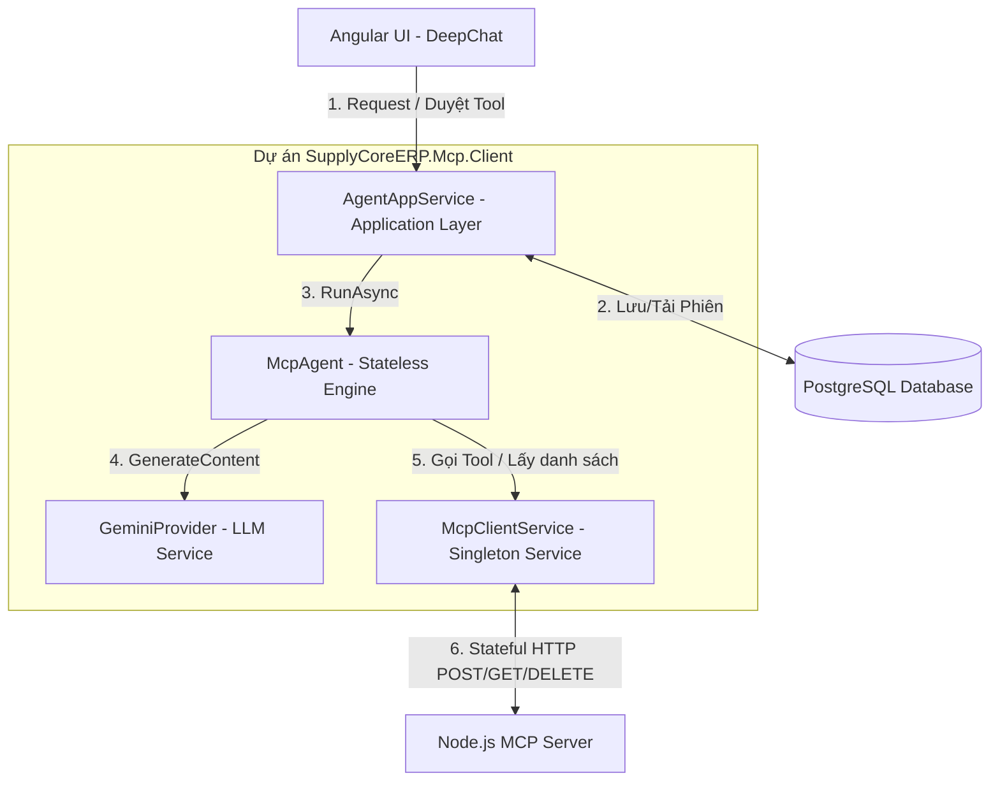
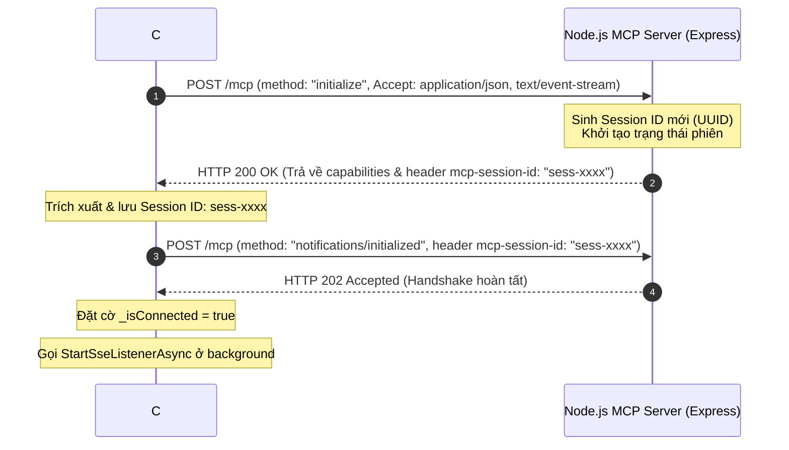
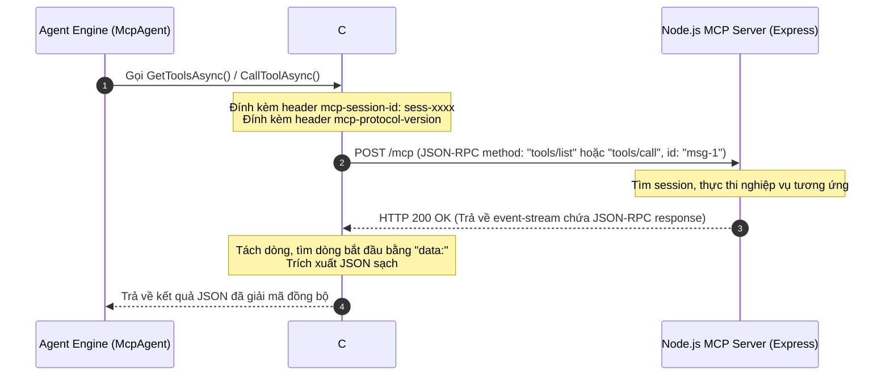
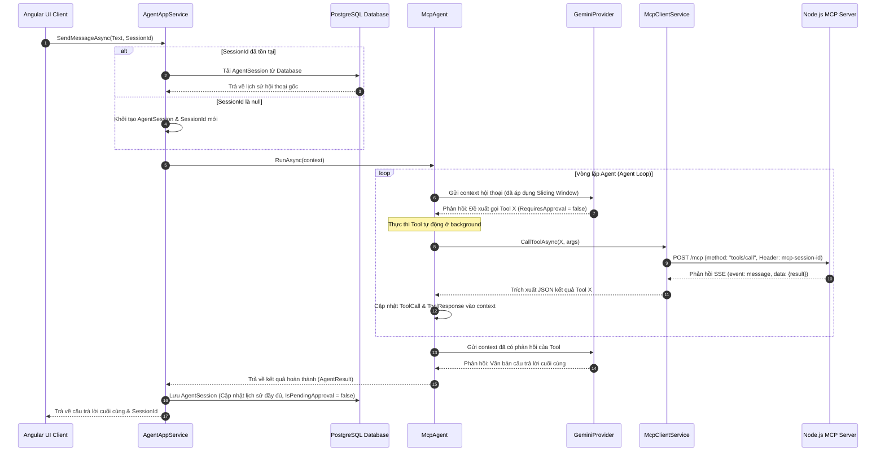
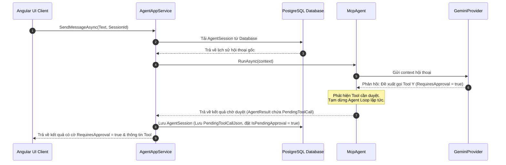
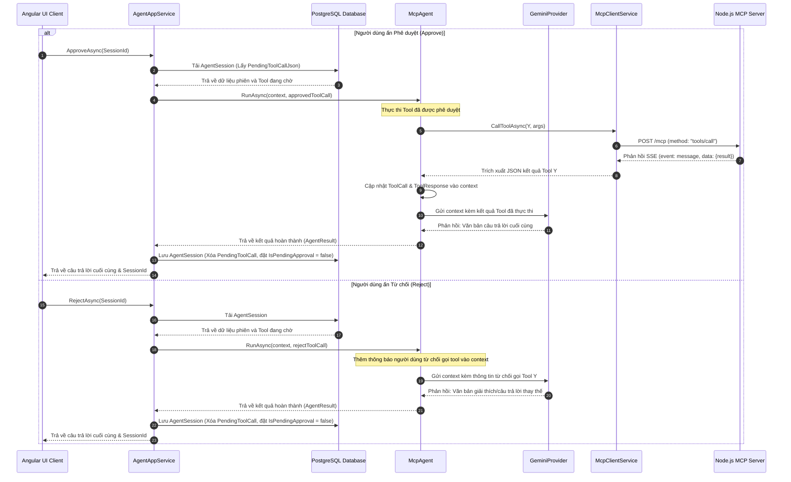

# Tài liệu Đặc tả Thiết kế & Triển khai C# MCP Client (SupplyCoreERP)
## Tích hợp AI Agent Stateful Streamable HTTP & Tối ưu hóa Context

Tài liệu này đặc tả chi tiết kiến trúc và thiết kế kỹ thuật của **C# MCP Client** trong dự án `SupplyCoreERP`. Thiết kế này áp dụng kết nối **Stateful Streamable HTTP** đến MCP Server, đóng gói logic Agent Loop trong lớp `McpAgent` hoàn toàn không có trạng thái (Stateless), và duy trì trạng thái phiên hội thoại (State Persistence) tại tầng Application qua thực thể `AgentSession` lưu trữ trong database PostgreSQL.

---

## 1. Kiến trúc C# MCP Client

Cấu trúc các lớp thuộc dự án `SupplyCoreERP.Mcp.Client` và sự tương tác với tầng Application:



### 1.1 Trách nhiệm của các cấu phần
*   **`AgentAppService`**: Quản lý đọc/ghi `AgentSession` từ PostgreSQL, cung cấp các API endpoint công khai để gửi tin nhắn (`SendMessageAsync`), phê duyệt gọi tool (`ApproveAsync`), và từ chối gọi tool (`RejectAsync`).
*   **`McpAgent`**: Bộ não điều phối cuộc hội thoại. Thực thi vòng lặp Agent (Agent Loop) gọi Gemini, phát hiện đề xuất gọi tool, xử lý logic Human-in-the-loop nếu tool yêu cầu duyệt (`RequiresApproval = true`), và áp dụng thuật toán tối ưu hóa ngữ cảnh trước khi gửi tin nhắn cho LLM.
*   **`McpClientService`**: Triển khai kết nối Stateful Streamable HTTP, thực hiện handshake, quản lý `sessionId`, gửi các request RPC và lắng nghe sự kiện thay đổi qua luồng SSE nền để quản lý xóa bộ nhớ đệm (cache invalidation).

---

## 2. Đặc tả Chi tiết Cấu phần C# Client

### 2.1 Cấu trúc Dịch vụ Kết nối mạng (`McpClientService.cs`)

`McpClientService` được khai báo là một `ISingletonDependency` trong ABP Framework. Nó thực hiện quản lý kết nối và giao tiếp mạng:

#### 1. Luồng thiết lập kết nối & Handshake (`EnsureConnectedAsync`)

Khi có yêu cầu gọi dịch vụ, nếu chưa kết nối, `McpClientService` thực hiện handshake thiết lập phiên thông qua sơ đồ sau:



#### 2. Luồng thực thi gọi RPC Tools đồng bộ (tools/list & tools/call)

Sơ đồ mô tả luồng gọi RPC đồng bộ thông qua HTTP POST và nhận kết quả trực tiếp từ Response Body (bóc tách từ định dạng SSE):



#### 3. Bộ lọc sự kiện nền & Giải phóng Cache (`StartSseListenerAsync`)
Để đồng bộ danh sách tool lập tức khi server thay đổi mà không tốn chi phí mạng gọi lại liên tục, danh sách tool được cache vô hạn trên RAM. Tiến trình lắng nghe SSE stream nền sẽ thực hiện invalidation khi có thông báo:
```csharp
using HttpResponseMessage response = await _httpClient.SendAsync(request, HttpCompletionOption.ResponseHeadersRead, token);
using Stream stream = await response.Content.ReadAsStreamAsync(token);
using StreamReader reader = new(stream);

while (!token.IsCancellationRequested)
{
    string? line = await reader.ReadLineAsync(token);
    if (line == null) break;
    if (string.IsNullOrEmpty(line)) continue;

    // Phát hiện dòng dữ liệu chứa sự kiện thay đổi tools của MCP v2
    if (line.StartsWith("data:") && line.Contains("notifications/tools/list_changed"))
    {
        await _cacheLock.WaitAsync(token);
        try
        {
            _cachedTools = null; // Giải phóng cache tools
        }
        finally
        {
            _cacheLock.Release();
        }
    }
}
```

#### 4. Cơ chế Caching Thread-safe
Sử dụng Double-checked locking với `SemaphoreSlim` để đảm bảo an toàn đa luồng khi khởi tạo cache:
```csharp
private static List<McpToolDto>? _cachedTools;
private static readonly SemaphoreSlim _cacheLock = new(1, 1);
```

---

### 2.2 Bộ điều phối Agent (`McpAgent.cs`)

Lớp `McpAgent` chịu trách nhiệm chạy Agent Loop và xử lý cửa sổ trượt ngữ cảnh (Context Sliding Window):

#### 1. Thuật toán Sliding Window tối ưu hóa ngữ cảnh
LLM (Gemini) giới hạn dung lượng và tốc độ xử lý khi lịch sử quá dài. `McpAgent` chỉ lấy tối đa 12 tin nhắn gần nhất.
*   **Nguyên tắc**: Nếu tin nhắn cũ nhất trong cửa sổ 12 tin nhắn là phản hồi của tool (`ToolResponse`), điểm cắt phải dịch lùi về trước để bao gồm cả yêu cầu gọi tool (`ToolCall`) tương ứng của nó. Việc này ngăn chặn lỗi LLM không hiểu dữ liệu trả về từ đâu.
*   **Triển khai**: Duyệt ngược danh sách tin nhắn từ vị trí cắt, nếu gặp `ToolResponses` thì dịch lùi cửa sổ cắt cho đến khi gặp tin nhắn chứa `ToolCalls` tương ứng của nó ở phía trước.

---

## 3. Cấu trúc Database Schema & DTOs

### 3.1 Sơ đồ trình tự Lưu trữ & Quản lý Phiên làm việc (State Persistence)

#### 1. Sơ đồ trình tự Agent-in-the-loop (Chạy tự động hoàn toàn)

Sơ đồ trình tự khi cuộc hội thoại tự động hoàn thành từ đầu đến cuối mà không cần người dùng duyệt tool (tất cả các tools được gọi đều có thuộc tính `RequiresApproval = false`):



#### 2. Sơ đồ trình tự Human-in-the-loop (Chờ người dùng phê duyệt)

Sơ đồ mô tả quy trình 2 giai đoạn độc lập khi gặp tool cần người dùng duyệt (`RequiresApproval = true`):

##### Giai đoạn 1: Phát hiện Tool cần duyệt và tạm dừng phiên


##### Giai đoạn 2: Người dùng gửi yêu cầu duyệt (Approve) hoặc từ chối (Reject)


Thực thể `AgentSession` kế thừa từ `CreationAuditedEntity<Guid>` để duy trì ngữ cảnh Agent trong PostgreSQL:

```csharp
public class AgentSession : CreationAuditedEntity<Guid>
{
    public Guid UserId { get; set; }
    
    // Lưu chuỗi JSON của danh sách lịch sử hội thoại đầy đủ
    public string ConversationHistoryJson { get; set; }
    
    // Đánh dấu phiên đang tạm dừng chờ người dùng phê duyệt
    public bool IsPendingApproval { get; set; }
    
    // Lưu thông tin của Tool Call đang chờ phê duyệt
    public string? PendingToolCallJson { get; set; }
}
```

### 3.2 Data Transfer Objects (DTOs)

#### `AgentRequestInputDto`
```csharp
public class AgentRequestInputDto
{
    [Required]
    public string Text { get; set; }
    public Guid? SessionId { get; set; } // UUID duy trì phiên làm việc
}
```

#### `AgentResponseOutputDto`
```csharp
public class AgentResponseOutputDto
{
    public string Text { get; set; }
    public Guid? SessionId { get; set; }
    public bool RequiresApproval { get; set; } // Báo cho UI hiển thị nút duyệt tool
    public AgentToolCallMessageDto? PendingToolCall { get; set; }
}
```

---

## 4. Đặc tả JSON-RPC Request/Response ở Phía Client

### 4.1 Request cấu hình Handshake gửi từ Client
*   **Route**: `POST /mcp`
*   **Headers**:
    ```http
    Accept: application/json, text/event-stream
    Content-Type: application/json
    ```
*   **Body**:
    ```json
    {
      "jsonrpc": "2.0",
      "id": "init-1",
      "method": "initialize",
      "params": {
        "protocolVersion": "2024-11-05",
        "capabilities": {},
        "clientInfo": { "name": "supplycore-csharp-client", "version": "1.0.0" }
      }
    }
    ```

### 4.2 Request gọi thực thi công cụ
*   **Route**: `POST /mcp`
*   **Headers**:
    ```http
    Accept: application/json, text/event-stream
    Content-Type: application/json
    mcp-session-id: sess-9b1deb4d-3b7d-4ba2-9118-208cf3112e5c
    mcp-protocol-version: 2024-11-05
    ```
*   **Body**:
    ```json
    {
      "jsonrpc": "2.0",
      "id": "req-uuid-abc",
      "method": "tools/call",
      "params": {
        "name": "get_products",
        "arguments": { "searchTerm": "Amlodipine" }
      }
    }
    ```
*   **Dữ liệu SSE nhận về từ stream**:
    ```text
    event: message
    data: {"jsonrpc":"2.0","id":"req-uuid-abc","result":{"content":[{"type":"text","text":"[{\"Code\":\"SP002\",\"Name\":\"Amlodipine 5mg\"}]"}]}}
    ```
    *(Client thực hiện trích xuất phần JSON bên trong `data:` để trả về kết quả).*
