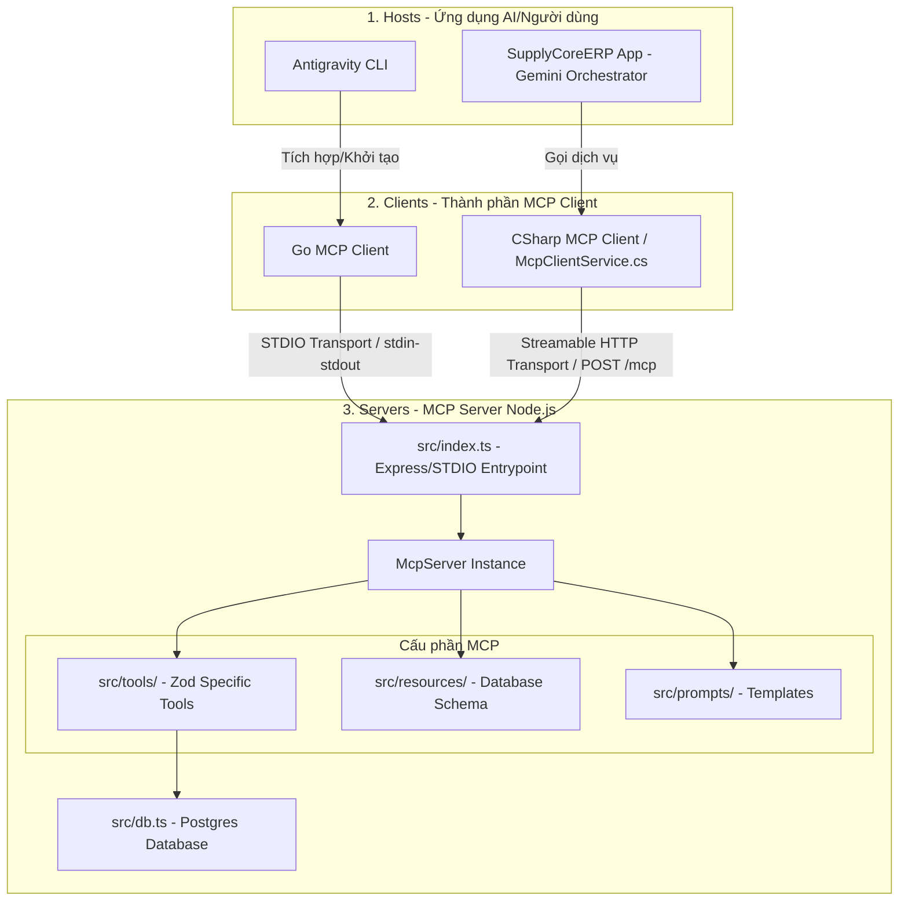

# MCP Server Tái cấu trúc & Nâng cấp Streamable HTTP - Tài liệu thiết kế

Tài liệu này đặc tả chi tiết kế hoạch chuyển đổi cơ chế kết nối từ SSE + HTTP POST cũ sang Streamable HTTP (Stateless JSON Mode), tái cấu trúc mã nguồn MCP Server Node.js sử dụng lớp `McpServer` và thư viện Zod, đồng thời nâng cấp mã nguồn C# Client của Backend.

---

## 1. Mục tiêu
- **Đơn giản hóa giao thức mạng**: Gộp luồng truyền nhận giữa C# Backend và MCP Server từ 2 kết nối vật lý độc lập (SSE GET + HTTP POST) thành 1 kết nối duy nhất (HTTP POST gửi JSON, nhận JSON).
- **Mã hóa và An toàn**: Loại bỏ việc quản lý `sessionId` thủ công và các nguy cơ mất đồng bộ phiên gây lỗi `session not found`.
- **Tự động hóa Schema**: Sử dụng Zod để định nghĩa các tool, tự động sinh ra JSON Schema chuẩn MCP cho AI hiểu và tự động validate kiểu dữ liệu đầu vào.
- **Tái cấu trúc mã nguồn**: Chia nhỏ mã nguồn Node.js thành các module độc lập bám sát đặc tả của MCP (Tools, Resources, Prompts) để dễ dàng bảo trì.

---

## 2. Thiết kế Kiến trúc Tổng thể (Chuẩn MCP 3 lớp)

Hệ thống tuân thủ chặt chẽ kiến trúc 3 lớp của giao thức Model Context Protocol:



---

## 3. Chi tiết Cấu trúc Thư mục MCP Server

Mã nguồn tại thư mục [mcp-server](file:///D:/ProjectOwner/SupplyCoreERP/mcp-server) được sắp xếp lại như sau:

- `src/tools/`
  - `product.ts`: Định nghĩa tool `get_products` (lấy danh mục sản phẩm).
  - `warehouse.ts`: Định nghĩa tool `get_warehouses` (lấy danh mục kho).
  - `supplier.ts`: Định nghĩa tool `get_suppliers` (lấy nhà cung cấp).
  - `customer.ts`: Định nghĩa tool `get_customers` (lấy khách hàng).
  - `batch.ts`: Định nghĩa tool `get_batches` (lấy lô hàng).
  - `unit.ts`: Định nghĩa tool `get_units` (lấy đơn vị tính).
  - `balance.ts`: Định nghĩa tool `get_inventory_balance` (lấy tồn kho thực tế).
- `src/resources/`
  - `dbSchema.ts`: Định nghĩa resource `db_schema` (schema database).
- `src/prompts/`
  - `assistant.ts`: Định nghĩa prompt `analyze_inventory_balance`.
- `src/db.ts`: Kết nối PostgreSQL.
- `src/index.ts`: Entry point chính khởi chạy ứng dụng.

---

## 4. Đặc tả Chi tiết các Cấu phần MCP

### 4.1. Định nghĩa Zod Tools (`src/tools/`)

Các file tool sẽ export một hàm `registerTool` để đăng ký với `McpServer`. Ví dụ chi tiết cho `get_products` và `get_warehouses`:

#### [src/tools/product.ts](file:///D:/ProjectOwner/SupplyCoreERP/mcp-server/src/tools/product.ts)
```typescript
import { z } from "zod";
import { McpServer } from "@modelcontextprotocol/sdk/server/mcp.js";
import { queryDb } from "../db.js";

export const registerProductTools = (server: McpServer) => {
  server.tool(
    "get_products",
    "Lấy danh sách các sản phẩm và thuốc trong hệ thống SupplyCoreERP.",
    {
      name: z.string().optional().describe("Tên sản phẩm cần tìm kiếm (ví dụ: Panadol)"),
      code: z.string().optional().describe("Mã sản phẩm cần tìm kiếm (ví dụ: MD2605260001)"),
      limit: z.number().optional().default(10).describe("Số lượng dòng tối đa cần lấy (tối đa 50)")
    },
    async ({ name, code, limit }) => {
      let query = `SELECT "Id", "Code", "Name", "BaseUnitId" FROM "AppProducts" WHERE "IsDeleted" = false`;
      const params: any[] = [];

      if (name) {
        params.push(`%${name}%`);
        query += ` AND "Name" ILIKE $${params.length}`;
      }
      if (code) {
        params.push(`%${code}%`);
        query += ` AND "Code" ILIKE $${params.length}`;
      }

      query += ` LIMIT $${params.length + 1}`;
      params.push(Math.min(limit, 50));

      const rows = await queryDb(query, params);
      if (rows.length === 0) {
        return { content: [{ type: "text", text: "Không tìm thấy sản phẩm nào phù hợp." }] };
      }

      const text = rows.map(r => `Mã: ${r.Code} | Tên: ${r.Name} | ID: ${r.Id}`).join("\n");
      return { content: [{ type: "text", text: `Danh sách sản phẩm:\n${text}` }] };
    }
  );
};
```

#### [src/tools/warehouse.ts](file:///D:/ProjectOwner/SupplyCoreERP/mcp-server/src/tools/warehouse.ts)
```typescript
import { z } from "zod";
import { McpServer } from "@modelcontextprotocol/sdk/server/mcp.js";
import { queryDb } from "../db.js";

export const registerWarehouseTools = (server: McpServer) => {
  server.tool(
    "get_warehouses",
    "Lấy danh sách các kho hàng trong hệ thống.",
    {
      name: z.string().optional().describe("Tên kho hàng cần tìm kiếm"),
      code: z.string().optional().describe("Mã kho hàng cần tìm kiếm"),
      limit: z.number().optional().default(10).describe("Số lượng dòng tối đa")
    },
    async ({ name, code, limit }) => {
      let query = `SELECT "Id", "Code", "Name", "Address" FROM "AppWarehouses" WHERE "IsDeleted" = false`;
      const params: any[] = [];

      if (name) {
        params.push(`%${name}%`);
        query += ` AND "Name" ILIKE $${params.length}`;
      }
      if (code) {
        params.push(`%${code}%`);
        query += ` AND "Code" ILIKE $${params.length}`;
      }

      query += ` LIMIT $${params.length + 1}`;
      params.push(Math.min(limit, 50));

      const rows = await queryDb(query, params);
      if (rows.length === 0) {
        return { content: [{ type: "text", text: "Không tìm thấy kho hàng nào phù hợp." }] };
      }

      const text = rows.map(r => `Mã: ${r.Code} | Tên: ${r.Name} | Địa chỉ: ${r.Address || 'N/A'}`).join("\n");
      return { content: [{ type: "text", text: `Danh sách kho hàng:\n${text}` }] };
    }
  );
};
```

Tương tự cho `get_suppliers`, `get_customers`, `get_batches`, `get_units` và `get_inventory_balance`.

### 4.2. Định nghĩa Resource (`src/resources/`)

#### [src/resources/dbSchema.ts](file:///D:/ProjectOwner/SupplyCoreERP/mcp-server/src/resources/dbSchema.ts)
```typescript
import { McpServer } from "@modelcontextprotocol/sdk/server/mcp.js";

export const registerDatabaseResources = (server: McpServer) => {
  server.resource(
    "db_schema",
    "schema://database",
    {
      mimeType: "text/markdown",
      description: "Cung cấp sơ đồ cấu trúc cơ sở dữ liệu các bảng của SupplyCoreERP để AI hiểu mối quan hệ khóa ngoại."
    },
    async () => {
      const schemaMarkdown = `
# Sơ đồ Cấu trúc Cơ sở dữ liệu (Database Schema)

## Bảng: AppProducts (Sản phẩm / Thuốc)
- Id: UUID (Khóa chính)
- Code: VARCHAR (Mã sản phẩm, ví dụ: MD2605260001)
- Name: VARCHAR (Tên sản phẩm, ví dụ: Panadol)
- BaseUnitId: UUID (Liên kết với AppBaseUnits)
- IsDeleted: BOOLEAN

## Bảng: AppWarehouses (Kho hàng)
- Id: UUID (Khóa chính)
- Code: VARCHAR (Mã kho, ví dụ: KHO_HCM)
- Name: VARCHAR (Tên kho)
- Address: VARCHAR
- IsDeleted: BOOLEAN

## Bảng: AppInventoryBalances (Tồn kho thực tế)
- Id: UUID (Khóa chính)
- ProductId: UUID (Khóa ngoại liên kết AppProducts)
- WarehouseId: UUID (Khóa ngoại liên kết AppWarehouses)
- Quantity: NUMERIC (Số lượng tồn kho)
- IsDeleted: BOOLEAN

## Bảng: AppSuppliers (Nhà cung cấp)
- Id: UUID
- Code: VARCHAR
- Name: VARCHAR
- PhoneNumber: VARCHAR
- Email: VARCHAR
- IsDeleted: BOOLEAN
      `;
      return {
        contents: [{
          uri: "schema://database",
          mimeType: "text/markdown",
          text: schemaMarkdown
        }]
      };
    }
  );
};
```

### 4.3. Định nghĩa Prompt Template (`src/prompts/`)

#### [src/prompts/assistant.ts](file:///D:/ProjectOwner/SupplyCoreERP/mcp-server/src/prompts/assistant.ts)
```typescript
import { McpServer } from "@modelcontextprotocol/sdk/server/mcp.js";
import { z } from "zod";

export const registerPrompts = (server: McpServer) => {
  server.prompt(
    "analyze_inventory_balance",
    {
      productName: z.string().describe("Tên sản phẩm/thuốc cần phân tích")
    },
    async ({ productName }) => {
      return {
        description: `Hướng dẫn AI phân tích tồn kho cho sản phẩm ${productName}`,
        messages: [{
          role: "user",
          content: {
            type: "text",
            text: `Bạn là chuyên gia phân tích kho hàng ERP. Hãy kiểm tra số lượng tồn kho của sản phẩm "${productName}" trên tất cả các kho của hệ thống. Chỉ ra kho nào có số lượng nhiều nhất, kho nào sắp hết hàng và đưa ra đề xuất luân chuyển hàng hóa.`
          }
        }]
      };
    }
  );
};
```

---

## 5. Cấu hình HTTP Server và Entrypoint (`src/index.ts`)

File [index.ts](file:///D:/ProjectOwner/SupplyCoreERP/mcp-server/src/index.ts) được thiết kế để hỗ trợ chạy song song 2 transport:

```typescript
import express from "express";
import { McpServer } from "@modelcontextprotocol/sdk/server/mcp.js";
import { NodeStreamableHTTPServerTransport } from "@modelcontextprotocol/sdk/server/streamableHttp.js";
import { StdioServerTransport } from "@modelcontextprotocol/sdk/server/stdio.js";
import dotenv from "dotenv";
import path from "path";
import { fileURLToPath } from "url";

// Import đăng ký tools, resources, prompts
import { registerProductTools } from "./tools/product.js";
import { registerWarehouseTools } from "./tools/warehouse.js";
import { registerDatabaseResources } from "./resources/dbSchema.js";
import { registerPrompts } from "./prompts/assistant.js";

const __filename = fileURLToPath(import.meta.url);
const __dirname = path.dirname(__filename);

dotenv.config({ path: path.resolve(__dirname, "../.env") });

const server = new McpServer({
  name: "supplycore-mcp-server",
  version: "1.0.0"
});

// Đăng ký toàn bộ tài nguyên với server
registerProductTools(server);
registerWarehouseTools(server);
registerDatabaseResources(server);
registerPrompts(server);

const isStdio = process.argv.includes("--stdio");

if (isStdio) {
  // 1. Chạy chế độ STDIO (Antigravity CLI)
  const transport = new StdioServerTransport();
  await server.connect(transport);
  console.error("[MCP-Server] Running on STDIO mode.");
} else {
  // 2. Chạy chế độ Streamable HTTP (C# Backend)
  const app = express();
  app.use(express.json());

  const transport = new NodeStreamableHTTPServerTransport({
    sessionIdGenerator: undefined, // Chạy stateless JSON mode
    enableJsonResponse: true      // Phản hồi JSON thuần túy thay vì SSE
  });

  await server.connect(transport);

  // Chỉ cần 1 endpoint POST duy nhất xử lý JSON request
  app.post("/mcp", async (req, res) => {
    await transport.handleRequest(req, res, req.body);
  });

  const port = process.env.PORT || 3000;
  app.listen(port, () => {
    console.log(`[MCP-Server] SupplyCore MCP Server running on http://127.0.0.1:${port}/mcp`);
  });
}
```

---

## 6. Nâng cấp Backend C# Client

Mã nguồn [McpClientService.cs](file:///D:/ProjectOwner/SupplyCoreERP/src/SupplyCoreERP.Mcp.Client/McpClientService.cs) sẽ được đơn giản hóa tối đa bằng cách gọi trực tiếp `/mcp` thông qua `PostAsJsonAsync`:

- **Bỏ**: Các luồng HTTP GET kết nối `/sse` ban đầu.
- **Bỏ**: Hàm `ReadSseResponseAsync` và các cơ chế đọc luồng SSE stream.
- **Thực hiện**:
  1. Gửi request lấy danh sách tools:
     ```csharp
     var listPayload = new { jsonrpc = "2.0", id = Guid.NewGuid().ToString(), method = "tools/list" };
     HttpResponseMessage listResponse = await _httpClient.PostAsJsonAsync($"{mcpBaseUrl}/mcp", listPayload);
     string listJson = await listResponse.Content.ReadAsStringAsync();
     // Parse kết quả trả về trực tiếp từ listJson
     ```
  2. Gửi request thực thi tool:
     ```csharp
     var callPayload = new {
         jsonrpc = "2.0",
         id = Guid.NewGuid().ToString(),
         method = "tools/call",
         @params = new { name = toolName, arguments = toolArgs }
     };
     HttpResponseMessage callResponse = await _httpClient.PostAsJsonAsync($"{mcpBaseUrl}/mcp", callPayload);
     string resultJson = await callResponse.Content.ReadAsStringAsync();
     // Trích xuất kết quả trực tiếp từ resultJson
     ```

---

## 7. Kế hoạch Triển khai (Phân rã Tasks)

1.  **Task 1 (Nâng cấp & Restructure MCP Server)**:
    - Nâng cấp `@modelcontextprotocol/sdk` lên phiên bản mới nhất và cài đặt `zod`.
    - Phân tách cấu trúc thư mục `src/tools/`, `src/resources/`, `src/prompts/`.
    - Cập nhật [db.ts](file:///D:/ProjectOwner/SupplyCoreERP/mcp-server/src/db.ts) và [index.ts](file:///D:/ProjectOwner/SupplyCoreERP/mcp-server/src/index.ts).
2.  **Task 2 (Biên dịch & Test STDIO)**:
    - Build dự án Node.js và test tích hợp trực tiếp qua Antigravity CLI bằng cờ `--stdio`.
3.  **Task 3 (Cập nhật C# Client)**:
    - Viết lại [McpClientService.cs](file:///D:/ProjectOwner/SupplyCoreERP/src/SupplyCoreERP.Mcp.Client/McpClientService.cs) theo mô hình Stateless HTTP JSON POST.
4.  **Task 4 (Kiểm thử Toàn hệ thống)**:
    - Bật Express App của MCP Server (`npm run start`).
    - Gọi API từ C# Backend để kiểm tra chức năng lấy danh mục sản phẩm, tồn kho và so khớp kết quả.
