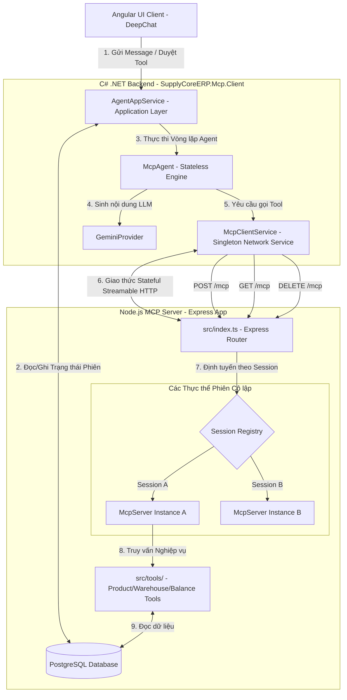
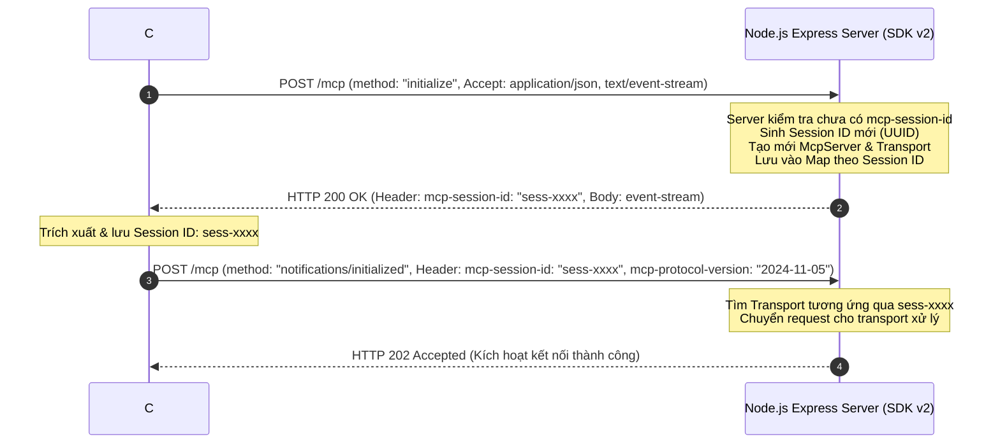
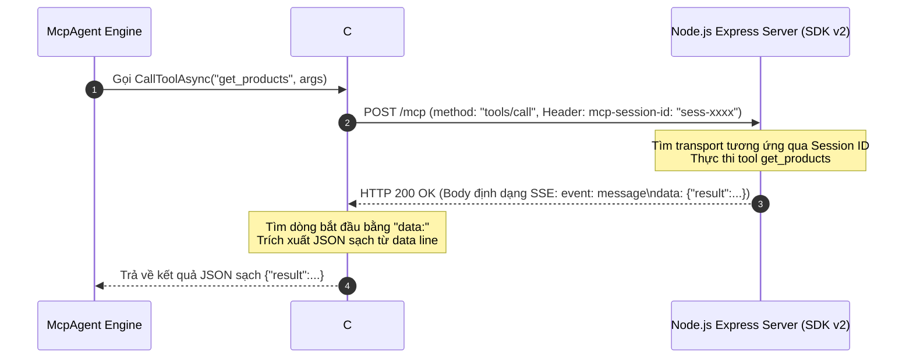
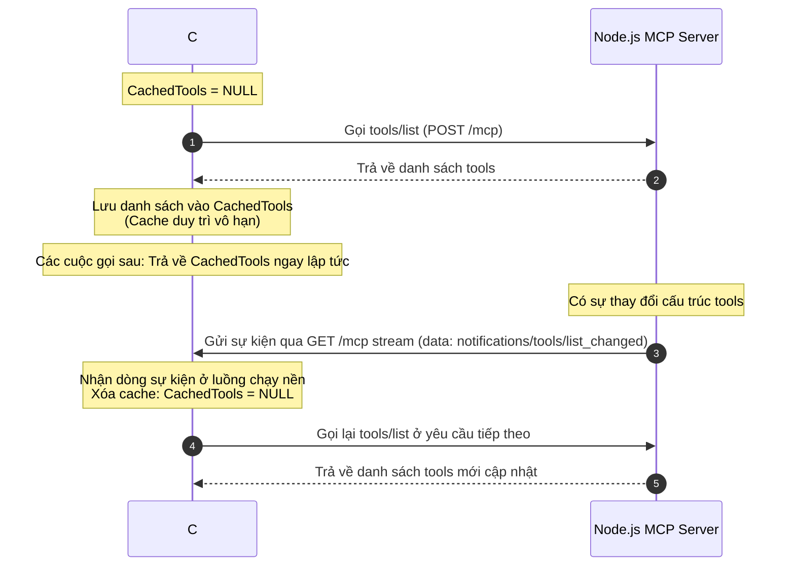

# Tài liệu Kiến trúc & Thiết kế Hệ thống MCP (Master Specification)
## SupplyCoreERP - Tích hợp AI Agent Stateful Streamable HTTP (SDK v2)

Tài liệu này đặc tả chi tiết kiến trúc tổng thể và thiết kế kỹ thuật liên thông giữa **C# MCP Host Client** (tầng Backend .NET 10.0) và **Node.js MCP Server** (tầng Dịch vụ AI SDK v2) trong dự án `SupplyCoreERP`. Hệ thống sử dụng giao thức **Stateful Streamable HTTP** chuẩn hóa để trao đổi thông tin, quản lý đa phiên cô lập (Multi-session) và tối ưu hóa hiệu năng bằng cơ chế cache vô hạn kết hợp giải phóng cache tự động qua luồng sự kiện SSE ở background.

---

## 1. Kiến trúc Tổng thể Hệ thống (System Architecture)

Hệ thống được thiết kế theo mô hình Clean Architecture & Domain-Driven Design (DDD), gồm 3 tầng chính theo đặc tả của Model Context Protocol:



### 1.1 Trách nhiệm của các cấu phần
*   **`Angular UI Client`**: Cung cấp giao diện chat trực quan cho người dùng, hỗ trợ phê duyệt hoặc từ chối gọi tool (Human-in-the-loop).
*   **`AgentAppService`**: Tầng Application quản lý trạng thái phiên làm việc (`AgentSession`) trong database, lưu trữ lịch sử hội thoại gốc.
*   **`McpAgent`**: Bộ não điều phối AI. Cắt bớt lịch sử hội thoại gửi lên Gemini API (tối đa 12 tin nhắn gần nhất) theo cơ chế **Context Sliding Window** nhưng bảo toàn các cặp `ToolCall` - `ToolResponse` ở biên cắt.
*   **`McpClientService`**: Quản lý kết nối mạng Stateful HTTP, lưu trữ `sessionId`, gửi các request RPC và tự động bóc tách định dạng SSE nhận từ Server. Nó duy trì một tiến trình nền đọc stream SSE nhằm phát hiện sự kiện thay đổi công cụ để xóa cache.
*   **`Node.js MCP Server`**: Sử dụng MCP SDK v2 và Express framework. Cung cấp API truy cập cơ sở dữ liệu SupplyCoreERP thông qua các tool nghiệp vụ khai báo bằng thư viện `zod` chuẩn Standard Schema. Quản lý các transport độc lập theo từng Session ID.

---

## 2. Đặc tả các Endpoints & Routes trên MCP Server

MCP Server Express cung cấp 4 endpoint chính để phục vụ kết nối Stateful Streamable HTTP:

| Phương thức | Route | Header bắt buộc | Mô tả |
| :--- | :--- | :--- | :--- |
| **POST** | `/mcp` | `Accept` (Xem chi tiết phía dưới)<br/>`mcp-session-id` (nếu đã kết nối)<br/>`mcp-protocol-version` (nếu đã kết nối) | Xử lý các thông điệp JSON-RPC gửi từ Client (bao gồm handshake `initialize`, gọi công cụ `tools/call`, lấy danh sách công cụ `tools/list`). |
| **GET** | `/mcp` | `mcp-session-id` | Thiết lập kết nối Server-Sent Events (SSE) dài hạn ở nền để nhận sự kiện từ Server đến Client. |
| **DELETE** | `/mcp` | `mcp-session-id` | Hủy phiên làm việc và giải phóng tài nguyên transport tương ứng trên Server. |
| **POST** | `/mcp/tools/changed` | *Không bắt buộc* | Endpoint nội bộ/mở rộng để kích hoạt phát thông báo thay đổi danh sách tool (`notifications/tools/list_changed`) tới toàn bộ các client đang kết nối. |

---

## 3. Cấu trúc Thông điệp Truyền thông (JSON-RPC Payloads)

### 3.1 Giai đoạn Bắt tay & Khởi tạo (Handshake)

#### Sơ đồ trình tự bắt tay:


#### Chi tiết Payload:
*   **Request POST `/mcp` (initialize)**:
    ```json
    {
      "jsonrpc": "2.0",
      "id": "init-1",
      "method": "initialize",
      "params": {
        "protocolVersion": "2024-11-05",
        "capabilities": {},
        "clientInfo": {
          "name": "supplycore-csharp-client",
          "version": "1.0.0"
        }
      }
    }
    ```
*   **Response Body** (Định dạng SSE do có Accept `text/event-stream`):
    ```text
    event: message
    data: {"jsonrpc":"2.0","id":"init-1","result":{"protocolVersion":"2024-11-05","capabilities":{"logging":{},"prompts":{},"resources":{"subscribe":true},"tools":{}},"serverInfo":{"name":"supplycore-mcp-server","version":"1.0.0"}}}
    ```
*   **Request POST `/mcp` (initialized notification)**:
    ```json
    {
      "jsonrpc": "2.0",
      "method": "notifications/initialized"
    }
    ```

---

### 3.2 Giao tiếp Lấy danh sách và Thực thi Công cụ (RPC Calls)

#### Sơ đồ trình tự gọi RPC:


#### Chi tiết Payload:
*   **Lấy danh sách Tools (Request / tools/list)**:
    ```json
    {
      "jsonrpc": "2.0",
      "id": "req-uuid-1",
      "method": "tools/list"
    }
    ```
*   **Response Body (tools/list)**:
    ```text
    event: message
    data: {"jsonrpc":"2.0","id":"req-uuid-1","result":{"tools":[{"name":"get_products","description":"Query medicines/products list","inputSchema":{"type":"object","properties":{"searchTerm":{"type":"string"}}}}],"nextPageToken":null}}
    ```
*   **Thực thi Tool (Request / tools/call)**:
    ```json
    {
      "jsonrpc": "2.0",
      "id": "req-uuid-2",
      "method": "tools/call",
      "params": {
        "name": "get_inventory_balance",
        "arguments": {
          "productCode": "SP001",
          "warehouseCode": "KHO_HCM"
        }
      }
    }
    ```
*   **Response Body (tools/call)**:
    ```text
    event: message
    data: {"jsonrpc":"2.0","id":"req-uuid-2","result":{"content":[{"type":"text","text":"[{\"ProductCode\":\"SP001\",\"WarehouseCode\":\"KHO_HCM\",\"PhysicalQty\":150.0}]"}]}}
    ```

---

### 3.3 Thông báo Sự thay đổi Danh sách Công cụ (Event Broadcast)

Khi danh sách công cụ được cập nhật trên MCP Server, Server sẽ phát sự kiện thông báo qua kết nối GET SSE dài hạn đang duy trì giữa Client và Server.

#### Luồng nhận sự kiện (GET `/mcp` - Event Stream)
*   **Headers gửi từ Client**:
    ```http
    Accept: text/event-stream
    mcp-session-id: sess-9b1deb4d-3b7d-4ba2-9118-208cf3112e5c
    ```
*   **Sự kiện Server đẩy về** (Khi Endpoint POST `/mcp/tools/changed` được gọi):
    ```text
    event: message
    data: {"jsonrpc":"2.0","method":"notifications/tools/list_changed"}
    ```

---

## 4. Cơ chế Cache vô hạn & Invalidation qua SSE

Để cân bằng giữa hiệu năng mạng và tính cập nhật tức thời của danh sách tools, hệ thống triển khai cơ chế kết hợp:



1.  **C# Client**: Cache danh sách tools vô hạn trên RAM (`_cachedTools` static). Chỉ cần danh sách này đã được nạp một lần, các yêu cầu tiếp theo sẽ được phục vụ ngay từ bộ nhớ mà không cần gọi mạng.
2.  **SSE Listener**: C# Client duy trì một luồng chạy nền `StartSseListenerAsync` để kết nối và đọc dòng dữ liệu SSE từ `GET /mcp?sessionId={sessionId}`. 
3.  **Invalidation**: Khi phát hiện dòng bắt đầu bằng `data:` có chứa chuỗi `"method":"notifications/tools/list_changed"`, C# Client tự động đặt `_cachedTools = null`. Lần yêu cầu danh sách tool tiếp theo sẽ buộc phải gửi request mạng lên Server để đồng bộ lại dữ liệu mới nhất.

---

## 5. Hướng dẫn Cấu hình Hệ thống (Configuration)

### 5.1 Cấu hình Biến môi trường
1.  **MCP Server**: Thiết lập tệp `.env` tại thư mục root của server:
    ```env
    PORT=3000
    DATABASE_URL=postgresql://<username>:<password>@<host>:<port>/SupplyCoreERP?sslmode=require
    ```
2.  **C# Client**: Cấu hình tệp `appsettings.json` của Web Host:
    ```json
    "McpServer": {
      "BaseUrl": "http://localhost:3000"
    }
    ```

### 5.2 Khởi chạy & Build
1.  **Build & Chạy MCP Server (HTTP)**:
    ```bash
    cd mcp-server
    npm install
    npm run build
    npm start
    ```
2.  **Build dự án C# Backend**:
    ```bash
    dotnet build
    ```
