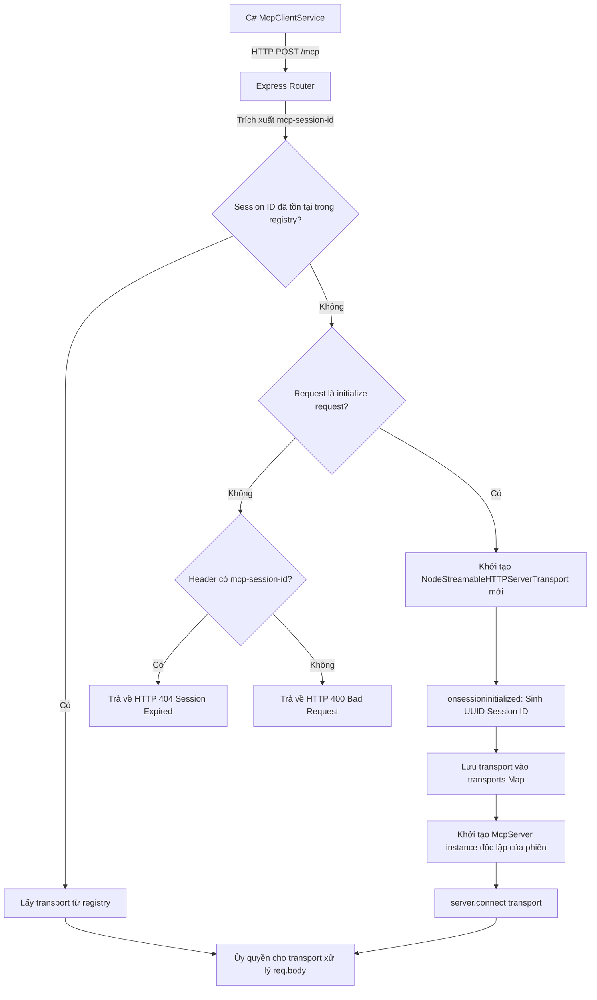
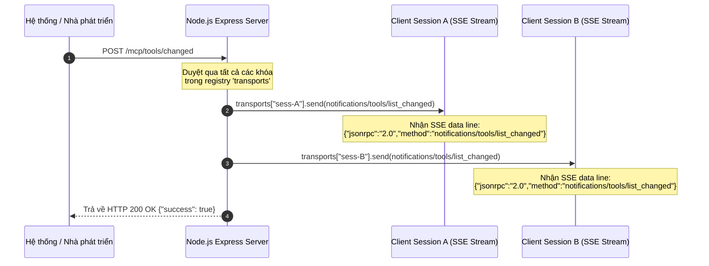

# Tài liệu Đặc tả Thiết kế & Triển khai Node.js MCP Server
## SupplyCoreERP - AI Agent Integration Service (Express & SDK v2)

Tài liệu này đặc tả chi tiết kiến trúc phần mềm, cấu trúc các router, và mô hình định nghĩa công cụ (Tools) sử dụng Zod Standard Schema trong Node.js MCP Server thuộc dự án `SupplyCoreERP`.

---

## 1. Kiến trúc Tổng thể & Công nghệ (Tech Stack)

*   **Runtime Environment**: Node.js (v20+), TypeScript.
*   **Web Framework**: Express (v5) để tiếp nhận và định tuyến các HTTP request.
*   **MCP Protocol Library**: `@modelcontextprotocol/server` & `@modelcontextprotocol/node` (phiên bản SDK v2) hỗ trợ Stateful Streamable HTTP và STDIO.
*   **Validation**: `zod` (v4) - tuân thủ Standard Schema đặc tả đầu vào của tools.
*   **Database Client**: `pg` (PostgreSQL Client) kết nối cơ sở dữ liệu Neon Cloud.

---

## 2. Express Router & Cơ chế Đa Phiên (Multi-session Registry)

Để xử lý đồng thời nhiều AI Agent Client kết nối độc lập, MCP Server lưu trữ các thực thể kết nối vật lý (`NodeStreamableHTTPServerTransport`) trong một Map động ở RAM:

```typescript
const transports: { [sessionId: string]: NodeStreamableHTTPServerTransport } = {};
```

### 2.1 Sơ đồ xử lý định tuyến đa phiên (Multi-session Session Registry Flow)

Sơ đồ khối mô tả luồng kiểm tra session và khởi tạo transport động khi nhận request POST tại endpoint `/mcp`:



---

### 2.2 Router POST `/mcp` (Xử lý các JSON-RPC Requests)
Endpoint chính tiếp nhận các request dạng POST. Nó định tuyến payload JSON-RPC cho đúng thực thể transport tương ứng với `sessionId` trong header:

*   **Headers yêu cầu**:
    *   `Accept`: `application/json, text/event-stream` (Bắt buộc để kích hoạt trả về SSE ở response).
    *   `mcp-session-id`: `{UUID}` (Bắt buộc cho các cuộc gọi RPC sau khi handshake).
    *   `mcp-protocol-version`: `2024-11-05`
*   **Request JSON-RPC Format**:
    ```json
    {
      "jsonrpc": "2.0",
      "id": "1",
      "method": "tools/list"
    }
    ```
*   **Response SSE Format**:
    ```text
    event: message
    data: {"jsonrpc":"2.0","id":"1","result":{"tools":[...]}}
    ```

---

### 2.3 Router GET `/mcp` (Thiết lập SSE Stream dài hạn)
Dùng để client thiết lập đường dẫn đẩy sự kiện một chiều từ Server về Client ở nền (background stream).
*   **Query/Header**: `sessionId` hoặc `mcp-session-id`
*   **Hành vi**: Server tìm kiếm transport trong registry. Nếu tìm thấy, ủy quyền cho transport duy trì luồng phản hồi dài hạn (SSE):
    ```typescript
    const transport = transports[sessionId];
    await transport.handleRequest(req, res);
    ```

---

### 2.4 Router DELETE `/mcp` (Đóng phiên làm việc)
*   **Header**: `mcp-session-id`
*   **Hành vi**: Đóng kết nối vật lý và giải phóng tài nguyên.
    ```typescript
    const transport = transports[sessionId];
    await transport.close();
    delete transports[sessionId];
    ```

---

### 2.5 Router POST `/mcp/tools/changed` & Luồng sự kiện Broadcast

Endpoint này phát sự kiện thông báo thay đổi tools cho toàn bộ các client đang duy trì kết nối SSE dài hạn ở nền:



*   **SSE data trả về client**:
    ```text
    event: message
    data: {"jsonrpc":"2.0","method":"notifications/tools/list_changed"}
    ```

---

## 3. Đặc tả Công cụ Nghiệp vụ ERP (Registered Tools)

Tất cả các tools đều được đăng ký với lớp `McpServer` qua Zod Standard Schema để tự động sinh JSON Schema tương thích LLM.

### 3.1 Tool `get_products` (Khai báo & Schema)
*   **Mục đích**: Tìm kiếm danh sách thuốc hoặc sản phẩm.
*   **Zod Schema (Zod Object)**:
    ```typescript
    z.object({
      searchTerm: z.string().optional().describe("Search term by product code or name")
    })
    ```
*   **Request JSON-RPC Payload**:
    ```json
    {
      "jsonrpc": "2.0",
      "id": "100",
      "method": "tools/call",
      "params": {
        "name": "get_products",
        "arguments": {
          "searchTerm": "Paracetamol"
        }
      }
    }
    ```
*   **Response JSON-RPC (trong data line)**:
    ```json
    {
      "jsonrpc": "2.0",
      "id": "100",
      "result": {
        "content": [
          {
            "type": "text",
            "text": "[{\"Id\":\"d1b54a8e...\",\"Code\":\"SP001\",\"Name\":\"Paracetamol 500mg\"}]"
          }
        ]
      }
    }
    ```

### 3.2 Tool `get_inventory_balance` (Khai báo & Schema)
*   **Mục đích**: Truy vấn số lượng tồn kho vật lý tại các kho.
*   **Zod Schema**:
    ```typescript
    z.object({
      productCode: z.string().describe("Product/medicine code to query (e.g., SP001)"),
      warehouseCode: z.string().optional().describe("Warehouse code to filter (e.g., KHO_HCM)")
    })
    ```
*   **Request JSON-RPC Payload**:
    ```json
    {
      "jsonrpc": "2.0",
      "id": "101",
      "method": "tools/call",
      "params": {
        "name": "get_inventory_balance",
        "arguments": {
          "productCode": "SP001",
          "warehouseCode": "KHO_HCM"
        }
      }
    }
    ```
*   **Response JSON-RPC**:
    ```json
    {
      "jsonrpc": "2.0",
      "id": "101",
      "result": {
        "content": [
          {
            "type": "text",
            "text": "[{\"ProductCode\":\"SP001\",\"WarehouseCode\":\"KHO_HCM\",\"PhysicalQty\":150.0}]"
          }
        ]
      }
    }
    ```

### 3.3 Danh sách các công cụ khác
1.  **`get_warehouses`**: Lấy danh mục kho hàng (`searchTerm?: string`).
2.  **`get_suppliers`**: Lấy thông tin nhà cung cấp (`searchTerm?: string`).
3.  **`get_customers`**: Lấy thông tin khách hàng (`searchTerm?: string`).
4.  **`get_batches`**: Lấy thông tin số lô sản phẩm (`productCode: string`, `batchNumber?: string`).
5.  **`get_units`**: Lấy danh sách đơn vị tính của sản phẩm.

---

## 4. Tương tác Cơ sở Dữ liệu (`db.ts`)

Mỗi khi công cụ được gọi, Server kết nối và truy vấn trực tiếp cơ sở dữ liệu PostgreSQL qua hàm `queryDb`:

```typescript
import pg from "pg";
const pool = new pg.Pool({
  connectionString: process.env.DATABASE_URL
});

export const queryDb = async (text: string, params?: any[]) => {
  const res = await pool.query(text, params);
  return res.rows;
};
```

Kết quả trả về từ database được serialize dưới dạng chuỗi JSON thô trong mảng `content` của kết quả JSON-RPC để LLM tự phân tích.
